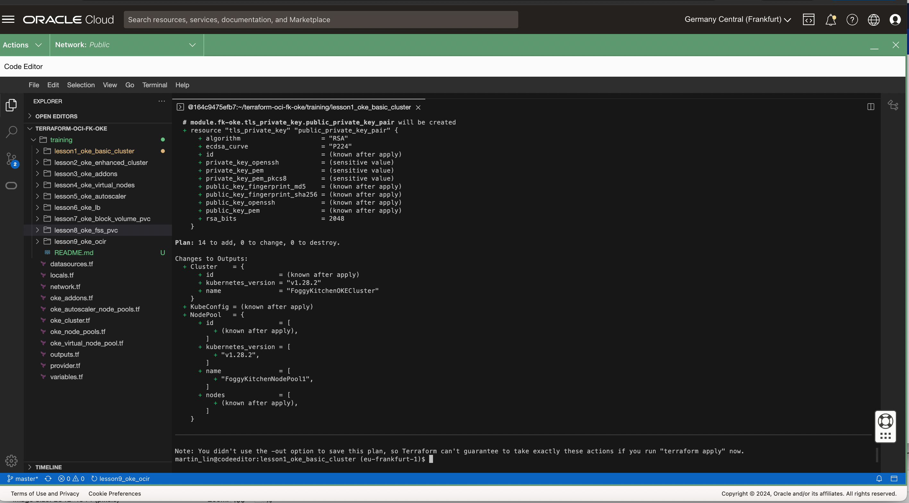

# FoggyKitchen OCI Container Engine for Kubernetes with Terraform 

## Course description

Are you ready to become an expert in deploying containerized applications to the cloud? With our self-study course, you’ll learn everything you need to know about using Oracle Cloud Infrastructure Container Engine for Kubernetes (OKE) with Terraform.

OKE is a fully-managed, scalable, and highly available service that allows you to deploy your cloud-native applications with ease. Whether you’re looking to build, deploy, or manage your applications, OKE is the perfect tool for the job. By specifying the compute resources you need, OKE provisions them on Oracle Cloud Infrastructure within your existing tenancy.

Our course is divided into two parts, covering the essential features of OKE and its deployment scenarios. With our comprehensive guidance, you’ll learn how to set up OKE and use it effectively in your everyday work. Don’t miss this opportunity to master OKE and take your containerization skills to the next level. Enroll now!

[Lesson 1: Creating OKE Basic Cluster](lesson1_oke_basic_cluster)

In this lesson, we'll guide you through the process of setting up a Basic OKE Cluster. This type of cluster supports all essential features offered by Kubernetes and the Container Engine for Kubernetes, but it lacks the advanced functionalities available in enhanced clusters, like virtual nodes and cluster add-on management. Although basic clusters are equipped with a service level objective (SLO), they do not come with a financially-backed service level agreement (SLA). 

[Lesson 2: Creating OKE Enhanced Cluster](lesson2_oke_enhanced_cluster)

In this tutorial, we will walk you through the configuration of an Enhanced OKE (Oracle Kubernetes Engine) Cluster. This advanced cluster configuration extends beyond the core capabilities offered by Kubernetes and the Container Engine for Kubernetes, incorporating premium features such as virtual nodes, cluster add-on management, and autoscaling. Unlike basic clusters, enhanced clusters are designed with a service level objective (SLO) and are supported by a financially-backed service level agreement (SLA), ensuring higher reliability and performance for your mission-critical applications. Enhanced clusters are ideal for users requiring advanced management, scalability, and reliability features directly integrated into their Kubernetes environment.

[Lesson 3: Creating OKE Enhanced Cluster with OKE Add-Ons](lesson3_oke_addons)

In this lesson, we delve into the creation of an OKE Enhanced Cluster with OKE Add-Ons, providing a comprehensive tutorial on how to leverage the advanced features of Oracle Kubernetes Engine (OKE). This lesson focuses on the enhanced cluster setup, emphasizing the integration of OKE Add-Ons for a robust, scalable, and efficient Kubernetes environment. 

[Lesson 4: Creating OKE Enhanced Cluster with Virtual NodePool](lesson4_oke_virtual_nodes)

In this lesson, we focus on setting up an OKE Enhanced Cluster with a Virtual NodePool. Virtual NodePools is a feature that enables on-demand scalability and efficient resource management without the need for physical node management. 

[Lesson 5: Creating OKE Enhanced Cluster with Autoscaler OKE Add-on](lesson5_oke_autoscaler)

In this lesson we explore the creation of an OKE Enhanced Cluster with the Autoscaler as an OKE Add-on, providing a step-by-step tutorial to harness the power of automatic scaling within your Oracle Kubernetes Engine (OKE) deployments. 

[Lesson 6: Creating OKE Cluster with OCI LoadBalancer as Kubernetes Service](lesson6_oke_lb)

In this lesson, we delve into the process of creating an OKE (Oracle Kubernetes Engine) Cluster with OCI (Oracle Cloud Infrastructure) Load Balancer as a Kubernetes Service, offering a detailed guide to integrating robust load balancing capabilities within your Kubernetes deployments. This lesson focuses on the strategic implementation of OCI Load Balancer as an integral service within your OKE cluster, aiming to enhance the distribution of traffic across your applications for improved availability and performance. 

[Lesson 7: Creating OKE Cluster with OCI Block Volume as Kubernetes PVC](lesson7_oke_block_volume_pvc)

In this lesson, we guide you through the creation of an OKE (Oracle Kubernetes Engine) Cluster with OCI (Oracle Cloud Infrastructure) Block Volume as Kubernetes Persistent Volume Claims (PVCs), providing a comprehensive tutorial on enhancing your Kubernetes deployments with durable and scalable storage solutions. This lesson is specifically designed to teach you how to leverage OCI Block Volumes for persistent storage needs within your Kubernetes environment, ensuring data persistence across pod reassignments and restarts. We will cover the intricacies of integrating OCI Block Volumes as PVCs, including provisioning, attaching, and managing block storage volumes to meet the dynamic storage requirements of your applications.

[Lesson 8: Creating OKE Cluster with OCI File Storage Service as Kubernetes PVC](lesson8_oke_fss_pvc)

In this lesson, we take a comprehensive look at creating an OKE (Oracle Kubernetes Engine) Cluster with OCI (Oracle Cloud Infrastructure) File Storage Service as Kubernetes Persistent Volume Claims (PVCs). This tutorial is aimed at equipping you with the knowledge to incorporate OCI File Storage Service into your Kubernetes deployments, offering a scalable, shared storage solution that supports the concurrent access needs of your applications. Throughout this lesson, we will dive into the process of setting up and integrating OCI File Storage Service as PVCs, demonstrating how to provision and mount shared file systems within your Kubernetes environment. The focus will be on the seamless management of file storage, enabling applications to efficiently share data across multiple pods and nodes.

[Lesson 9: Creating OKE Cluster with image taken from OCI Registry](lesson9_oke_ocir)

In this lesson, we focus on the creation of an OKE (Oracle Kubernetes Engine) Cluster utilizing images stored in the OCI Registry (OCIR). This tutorial aims to provide a detailed walkthrough for leveraging the Oracle Cloud Infrastructure Registry, a managed Docker registry service, for storing and managing your Docker images. Throughout this lesson, we will guide you through the process of configuring your OKE cluster to pull application images directly from OCIR, highlighting the seamless integration between OCI services and Kubernetes deployments.

