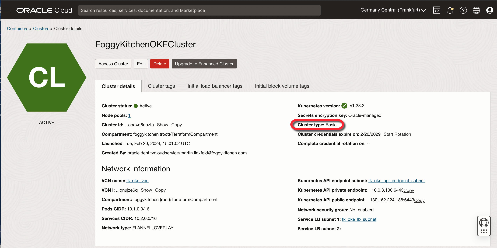

# FoggyKitchen OCI Container Engine for Kubernetes with Terraform 

## LESSON 1 - Creating OKE Basic Cluster

In this tutorial, we'll guide you through the process of setting up a Basic OKE Cluster. This type of cluster supports all essential features offered by Kubernetes and the Container Engine for Kubernetes, but it lacks the advanced functionalities available in enhanced clusters, like virtual nodes and cluster add-on management. Although basic clusters are equipped with a service level objective (SLO), they do not come with a financially-backed service level agreement (SLA). 



## Deploy Using Oracle Resource Manager

1. Click [](https://cloud.oracle.com/resourcemanager/stacks/create?region=home&zipUrl=https://github.com/mlinxfeld/terraform-oci-fk-oke/releases/latest/download/terraform-oci-fk-oke-lesson1.zip)

    If you aren't already signed in, when prompted, enter the tenancy and user credentials.

2. Review and accept the terms and conditions.

3. Select the region where you want to deploy the stack.

4. Follow the on-screen prompts and instructions to create the stack.

5. After creating the stack, click **Terraform Actions**, and select **Plan**.

6. Wait for the job to be completed, and review the plan.

    To make any changes, return to the Stack Details page, click **Edit Stack**, and make the required changes. Then, run the **Plan** action again.

7. If no further changes are necessary, return to the Stack Details page, click **Terraform Actions**, and select **Apply**. 

## Deploy Using the Terraform CLI in Cloud Shell

### Clone of the repo into OCI CLoud Shell

Now, you'll want a local copy of this repo. You can make that with the commands:
Clone the repo from github by executing the command as follows and then go to proper subdirectory:

```
martin_lin@codeeditor:~ (eu-frankfurt-1)$ git clone https://github.com/mlinxfeld/terraform-oci-fk-oke.git

martin_lin@codeeditor:~ (eu-frankfurt-1)$ cd terraform-oci-fk-oke

martin_lin@codeeditor:terraform-oci-fk-oke (eu-frankfurt-1)$ cd training/lesson1_oke_basic_cluster/
```

### Prerequisites
Create environment file with terraform.tfvars file starting with example file:

```
martin_lin@codeeditor:lesson1_oke_basic_cluster (eu-frankfurt-1)$ cp terraform.tfvars.example terraform.tfvars

martin_lin@codeeditor:lesson1_oke_basic_cluster (eu-frankfurt-1)$ vi terraform.tfvars

tenancy_ocid       = "ocid1.tenancy.oc1..<your_tenancy_ocid>"
compartment_ocid   = "ocid1.compartment.oc1..<your_comparment_ocid>"
region             = "<oci_region>"
```

### Initilize Terraform

Run the following command to initialize Terraform environment:

```
martin_lin@codeeditor:lesson1_oke_basic_cluster (eu-frankfurt-1)$ terraform init

Initializing the backend...
Initializing modules...
Downloading git::https://github.com/mlinxfeld/terraform-oci-fk-oke.git for fk-oke...
- fk-oke in .terraform/modules/fk-oke

Initializing provider plugins...
- Reusing previous version of oracle/oci from the dependency lock file
- Reusing previous version of hashicorp/tls from the dependency lock file
- Installing oracle/oci v5.29.0...
- Installed oracle/oci v5.29.0 (signed by a HashiCorp partner, key ID 1533A49284137CEB)
- Installing hashicorp/tls v4.0.5...
- Installed hashicorp/tls v4.0.5 (signed by HashiCorp)

Partner and community providers are signed by their developers.
If you'd like to know more about provider signing, you can read about it here:
https://www.terraform.io/docs/cli/plugins/signing.html

Terraform has been successfully initialized!

You may now begin working with Terraform. Try running "terraform plan" to see
any changes that are required for your infrastructure. All Terraform commands
should now work.

If you ever set or change modules or backend configuration for Terraform,
rerun this command to reinitialize your working directory. If you forget, other
commands will detect it and remind you to do so if necessary.
```

### Apply the changes 

Run the following command for applying changes with the proposed plan:

```
martin_lin@codeeditor:lesson1_oke_basic_cluster (eu-frankfurt-1)$ terraform apply
module.fk-oke.data.oci_containerengine_node_pool_option.fk_oke_node_pool_option: Reading...
module.fk-oke.data.oci_containerengine_addon_options.fk_oke_addon_options: Reading...
module.fk-oke.data.oci_identity_availability_domains.ADs: Reading...
module.fk-oke.data.oci_containerengine_cluster_option.fk_oke_cluster_option: Reading...
module.fk-oke.data.oci_identity_availability_domains.AD: Reading...
module.fk-oke.data.oci_core_services.AllOCIServices[0]: Reading...
module.fk-oke.data.oci_core_services.AllOCIServices[0]: Read complete after 0s [id=CoreServicesDataSource-0]
module.fk-oke.data.oci_identity_availability_domains.ADs: Read complete after 0s [id=IdentityAvailabilityDomainsDataSource-3596290162]
module.fk-oke.data.oci_containerengine_cluster_option.fk_oke_cluster_option: Read complete after 0s [id=ContainerengineClusterOptionDataSource-1870923232]
module.fk-oke.data.oci_identity_availability_domains.AD: Read complete after 0s [id=IdentityAvailabilityDomainsDataSource-3596290162]
module.fk-oke.data.oci_containerengine_addon_options.fk_oke_addon_options: Read complete after 0s [id=ContainerengineAddonOptionsDataSource-1219351960]
module.fk-oke.data.oci_containerengine_node_pool_option.fk_oke_node_pool_option: Read complete after 1s [id=ContainerengineNodePoolOptionDataSource-1870923232]

Terraform used the selected providers to generate the following execution
plan. Resource actions are indicated with the following symbols:
  + create
 <= read (data resources)

Terraform will perform the following actions:

  # module.fk-oke.data.oci_containerengine_addons.fk_oke_cluster_addons will be read during apply
  # (config refers to values not yet known)
 <= data "oci_containerengine_addons" "fk_oke_cluster_addons" {
      + addons     = (known after apply)
      + cluster_id = (known after apply)
      + id         = (known after apply)
    }

  # module.fk-oke.data.oci_containerengine_cluster_kube_config.KubeConfig will be read during apply
  # (config refers to values not yet known)
 <= data "oci_containerengine_cluster_kube_config" "KubeConfig" {
      + cluster_id    = (known after apply)
      + content       = (known after apply)
      + id            = (known after apply)
      + token_version = "2.0.0"
    }

  # module.fk-oke.oci_containerengine_cluster.fk_oke_cluster will be created
  + resource "oci_containerengine_cluster" "fk_oke_cluster" {
      + available_kubernetes_upgrades = (known after apply)
      + compartment_id                = "ocid1.compartment.oc1..aaaaaaaaiyy4srmrb32v5rlniicwmpxsytywiucgbcp5ext6e4ahjfuloewa"
      + defined_tags                  = (known after apply)
      + endpoints                     = (known after apply)
      + freeform_tags                 = (known after apply)
      + id                            = (known after apply)
      + kms_key_id                    = (known after apply)
      + kubernetes_version            = "v1.28.2"
      + lifecycle_details             = (known after apply)
      + metadata                      = (known after apply)
      + name                          = "FoggyKitchenOKECluster"
      + state                         = (known after apply)
      + type                          = "BASIC_CLUSTER"
      + vcn_id                        = (known after apply)

      + endpoint_config {
          + is_public_ip_enabled = true
          + subnet_id            = (known after apply)
        }

      + options {
          + service_lb_subnet_ids = (known after apply)

          + add_ons {
              + is_kubernetes_dashboard_enabled = true
              + is_tiller_enabled               = true
            }

          + admission_controller_options {
              + is_pod_security_policy_enabled = false
            }

          + kubernetes_network_config {
              + pods_cidr     = "10.1.0.0/16"
              + services_cidr = "10.2.0.0/16"
            }
        }
    }

  # module.fk-oke.oci_containerengine_node_pool.fk_oke_node_pool[0] will be created
  + resource "oci_containerengine_node_pool" "fk_oke_node_pool" {
      + cluster_id          = (known after apply)
      + compartment_id      = "ocid1.compartment.oc1..aaaaaaaaiyy4srmrb32v5rlniicwmpxsytywiucgbcp5ext6e4ahjfuloewa"
      + defined_tags        = (known after apply)
      + freeform_tags       = (known after apply)
      + id                  = (known after apply)
      + kubernetes_version  = "v1.28.2"
      + lifecycle_details   = (known after apply)
      + name                = "FoggyKitchenNodePool1"
      + node_image_id       = (known after apply)
      + node_image_name     = (known after apply)
      + node_metadata       = (known after apply)
      + node_shape          = "VM.Standard.A1.Flex"
      + node_source         = (known after apply)
      + nodes               = (known after apply)
      + quantity_per_subnet = (known after apply)
      + ssh_public_key      = (known after apply)
      + state               = (known after apply)
      + subnet_ids          = (known after apply)

      + initial_node_labels {
          + key   = "key"
          + value = "value"
        }

      + node_config_details {
          + defined_tags                        = (known after apply)
          + freeform_tags                       = (known after apply)
          + is_pv_encryption_in_transit_enabled = (known after apply)
          + kms_key_id                          = (known after apply)
          + nsg_ids                             = (known after apply)
          + size                                = 3

          + placement_configs {
              + availability_domain     = "unja:EU-FRANKFURT-1-AD-1"
              + capacity_reservation_id = (known after apply)
              + fault_domains           = (known after apply)
              + subnet_id               = (known after apply)
            }
          + placement_configs {
              + availability_domain     = "unja:EU-FRANKFURT-1-AD-2"
              + capacity_reservation_id = (known after apply)
              + fault_domains           = (known after apply)
              + subnet_id               = (known after apply)
            }
          + placement_configs {
              + availability_domain     = "unja:EU-FRANKFURT-1-AD-3"
              + capacity_reservation_id = (known after apply)
              + fault_domains           = (known after apply)
              + subnet_id               = (known after apply)
            }
        }

      + node_shape_config {
          + memory_in_gbs = 4
          + ocpus         = 1
        }

      + node_source_details {
          + boot_volume_size_in_gbs = "50"
          + image_id                = "ocid1.image.oc1.eu-frankfurt-1.aaaaaaaaiiymiaz2loraurxo6dgj5y4oiturf4inrkzvwimzw3d2a42kns6q"
          + source_type             = "IMAGE"
        }
    }

  (...)

  # module.fk-oke.tls_private_key.public_private_key_pair will be created
  + resource "tls_private_key" "public_private_key_pair" {
      + algorithm                     = "RSA"
      + ecdsa_curve                   = "P224"
      + id                            = (known after apply)
      + private_key_openssh           = (sensitive value)
      + private_key_pem               = (sensitive value)
      + private_key_pem_pkcs8         = (sensitive value)
      + public_key_fingerprint_md5    = (known after apply)
      + public_key_fingerprint_sha256 = (known after apply)
      + public_key_openssh            = (known after apply)
      + public_key_pem                = (known after apply)
      + rsa_bits                      = 2048
    }

Plan: 14 to add, 0 to change, 0 to destroy.

Changes to Outputs:
  + Cluster    = {
      + id                 = (known after apply)
      + kubernetes_version = "v1.28.2"
      + name               = "FoggyKitchenOKECluster"
    }
  + KubeConfig = (known after apply)
  + NodePool   = {
      + id                 = [
          + (known after apply),
        ]
      + kubernetes_version = [
          + "v1.28.2",
        ]
      + name               = [
          + "FoggyKitchenNodePool1",
        ]
      + nodes              = [
          + (known after apply),
        ]
    }

Do you want to perform these actions?
  Terraform will perform the actions described above.
  Only 'yes' will be accepted to approve.

  Enter a value: yes

module.fk-oke.tls_private_key.public_private_key_pair: Creating...
module.fk-oke.tls_private_key.public_private_key_pair: Creation complete after 0s [id=25af89a6ad0d55a3b45e3f7c5a43b99f6cdaebdb]
module.fk-oke.oci_core_vcn.fk_oke_vcn[0]: Creating...
module.fk-oke.oci_core_vcn.fk_oke_vcn[0]: Creation complete after 1s [id=ocid1.vcn.oc1.eu-frankfurt-1.amaaaaaadngk4giaxvol2s7zfhugz6sciwb3y45j6smayqymg4vkjef35kjq]
module.fk-oke.oci_core_internet_gateway.fk_oke_igw[0]: Creating...
module.fk-oke.oci_core_service_gateway.fk_oke_sg[0]: Creating...
module.fk-oke.oci_core_nat_gateway.fk_oke_natgw[0]: Creating...
module.fk-oke.oci_core_security_list.fk_oke_api_endpoint_subnet_sec_list[0]: Creating...
(...)
module.fk-oke.oci_containerengine_node_pool.fk_oke_node_pool[0]: Still creating... [5m0s elapsed]
module.fk-oke.oci_containerengine_node_pool.fk_oke_node_pool[0]: Still creating... [5m10s elapsed]
module.fk-oke.oci_containerengine_node_pool.fk_oke_node_pool[0]: Still creating... [5m20s elapsed]
module.fk-oke.oci_containerengine_node_pool.fk_oke_node_pool[0]: Creation complete after 5m29s [id=ocid1.nodepool.oc1.eu-frankfurt-1.aaaaaaaarrkf2m5b3s3mvkazlwow3lcjitisyavj3qmg62fb4nm4godpqsfa]

Apply complete! Resources: 14 added, 0 changed, 0 destroyed.

Outputs:

Cluster = {
  "id" = "ocid1.cluster.oc1.eu-frankfurt-1.aaaaaaaars4klton24xbdvuk3xquuik3dw4yf6b453asacctbcbuuqelc7ja"
  "kubernetes_version" = "v1.28.2"
  "name" = "FoggyKitchenOKECluster"
}
KubeConfig = <<EOT
---
apiVersion: v1
kind: ""
clusters:
- name: cluster-cbuuqelc7ja
  cluster:
    server: https://130.162.254.48:6443
    certificate-authority-data: LS0tLS1(...)URS0tLS0tCg==
users:
- name: user-cbuuqelc7ja
  user:
    exec:
      apiVersion: client.authentication.k8s.io/v1beta1
      command: oci
      args:
      - ce
      - cluster
      - generate-token
      - --cluster-id
      - ocid1.cluster.oc1.eu-frankfurt-1.aaaaaaaars4klton24xbdvuk3xquuik3dw4yf6b453asacctbcbuuqelc7ja
      - --region
      - eu-frankfurt-1
      env: []
contexts:
- name: context-cbuuqelc7ja
  context:
    cluster: cluster-cbuuqelc7ja
    user: user-cbuuqelc7ja
current-context: context-cbuuqelc7ja

EOT
NodePool = {
  "id" = tolist([
    "ocid1.nodepool.oc1.eu-frankfurt-1.aaaaaaaarrkf2m5b3s3mvkazlwow3lcjitisyavj3qmg62fb4nm4godpqsfa",
  ])
  "kubernetes_version" = tolist([
    "v1.28.2",
  ])
  "name" = tolist([
    "FoggyKitchenNodePool1",
  ])
  "nodes" = [
    tolist([
      "10.0.1.198",
      "10.0.1.96",
      "10.0.1.6",
    ]),
  ]
}
```

### Destroy the changes 

Run the following command for destroying all resources:

```
martin_lin@codeeditor:lesson1_oke_basic_cluster (eu-frankfurt-1)$ terraform destroy
module.fk-oke.tls_private_key.public_private_key_pair: Refreshing state... [id=25af89a6ad0d55a3b45e3f7c5a43b99f6cdaebdb]
module.fk-oke.data.oci_containerengine_addon_options.fk_oke_addon_options: Reading...
module.fk-oke.oci_core_vcn.fk_oke_vcn[0]: Refreshing state... [id=ocid1.vcn.oc1.eu-frankfurt-1.amaaaaaadngk4giaxvol2s7zfhugz6sciwb3y45j6smayqymg4vkjef35kjq]
module.fk-oke.data.oci_identity_availability_domains.AD: Reading...
(...)
module.fk-oke.data.oci_containerengine_addons.fk_oke_cluster_addons: Read complete after 0s [id=ContainerengineAddonsDataSource-2576186427]
module.fk-oke.data.oci_containerengine_cluster_kube_config.KubeConfig: Read complete after 0s [id=ContainerengineClusterKubeConfigDataSource-1636726932]

Terraform used the selected providers to generate the following execution plan. Resource actions are indicated with the following symbols:
  - destroy

Terraform will perform the following actions:

  # module.fk-oke.oci_containerengine_cluster.fk_oke_cluster will be destroyed
  - resource "oci_containerengine_cluster" "fk_oke_cluster" {
      - available_kubernetes_upgrades = [] -> null
      - compartment_id                = "ocid1.compartment.oc1..aaaaaaaaiyy4srmrb32v5rlniicwmpxsytywiucgbcp5ext6e4ahjfuloewa" -> null
      - defined_tags                  = {} -> null
      - endpoints                     = [
          - {
              - kubernetes            = ""
              - private_endpoint      = "10.0.3.30:6443"
              - public_endpoint       = "130.162.254.48:6443"
              - vcn_hostname_endpoint = ""
            },
        ] -> null
      - freeform_tags                 = {} -> null
      - id                            = "ocid1.cluster.oc1.eu-frankfurt-1.aaaaaaaars4klton24xbdvuk3xquuik3dw4yf6b453asacctbcbuuqelc7ja" -> null
      - kubernetes_version            = "v1.28.2" -> null
      - metadata                      = [
          - {
              - created_by_user_id         = "ocid1.user.oc1..aaaaaaaahm27xm4lh7nnboyqkt7fxfo7yja5iqb6qpvqvq5eus22ogparkaa"
              - created_by_work_request_id = "ocid1.clustersworkrequest.oc1.eu-frankfurt-1.aaaaaaaawflye5u5qcy6z4cu3tq4mhkhaes2ext62dsy7djaqwjloxivavrq"
              - deleted_by_user_id         = ""
              - deleted_by_work_request_id = ""
              - time_created               = "2024-02-20 13:55:01 +0000 UTC"
              - time_credential_expiration = "2029-02-20 13:55:34 +0000 UTC"
              - time_deleted               = ""
              - time_updated               = ""
              - updated_by_user_id         = ""
              - updated_by_work_request_id = ""
            },
        ] -> null
      - name                          = "FoggyKitchenOKECluster" -> null
      - state                         = "ACTIVE" -> null
      - type                          = "BASIC_CLUSTER" -> null
      - vcn_id                        = "ocid1.vcn.oc1.eu-frankfurt-1.amaaaaaadngk4giaxvol2s7zfhugz6sciwb3y45j6smayqymg4vkjef35kjq" -> null

      - cluster_pod_network_options {
          - cni_type = "FLANNEL_OVERLAY" -> null
        }

      - endpoint_config {
          - is_public_ip_enabled = true -> null
          - nsg_ids              = [] -> null
          - subnet_id            = "ocid1.subnet.oc1.eu-frankfurt-1.aaaaaaaawfcgipmpd6x3elog5lc5h57hstax5xtsf2a6fjg2novid63cigea" -> null
        }

      - image_policy_config {
          - is_policy_enabled = false -> null
        }

      - options {
          - service_lb_subnet_ids = [
              - "ocid1.subnet.oc1.eu-frankfurt-1.aaaaaaaa67s3ykt7q2n763kzleoovpb5hedissgk4e7xmbxrtiftxijjyn6a",
            ] -> null

          - add_ons {
              - is_kubernetes_dashboard_enabled = true -> null
              - is_tiller_enabled               = true -> null
            }

          - admission_controller_options {
              - is_pod_security_policy_enabled = false -> null
            }

          - kubernetes_network_config {
              - pods_cidr     = "10.1.0.0/16" -> null
              - services_cidr = "10.2.0.0/16" -> null
            }

          - persistent_volume_config {
              - defined_tags  = {} -> null
              - freeform_tags = {} -> null
            }

          - service_lb_config {
              - defined_tags  = {} -> null
              - freeform_tags = {} -> null
            }
        }
    }

(...)

Plan: 0 to add, 0 to change, 14 to destroy.

(...)

Do you really want to destroy all resources?
  Terraform will destroy all your managed infrastructure, as shown above.
  There is no undo. Only 'yes' will be accepted to confirm.

  Enter a value: yes

module.fk-oke.oci_containerengine_node_pool.fk_oke_node_pool[0]: Destroying... [id=ocid1.nodepool.oc1.eu-frankfurt-1.aaaaaaaarrkf2m5b3s3mvkazlwow3lcjitisyavj3qmg62fb4nm4godpqsfa]
module.fk-oke.oci_containerengine_node_pool.fk_oke_node_pool[0]: Still destroying... [id=ocid1.nodepool.oc1.eu-frankfurt-1.aaaaa...azlwow3lcjitisyavj3qmg62fb4nm4godpqsfa, 10s elapsed]
module.fk-oke.oci_containerengine_node_pool.fk_oke_node_pool[0]: Still destroying... [id=ocid1.nodepool.oc1.eu-frankfurt-1.aaaaa...azlwow3lcjitisyavj3qmg62fb4nm4godpqsfa, 20s elapsed]
(...)
module.fk-oke.oci_core_nat_gateway.fk_oke_natgw[0]: Destruction complete after 1s
module.fk-oke.oci_core_service_gateway.fk_oke_sg[0]: Destruction complete after 7s
module.fk-oke.oci_core_vcn.fk_oke_vcn[0]: Destroying... [id=ocid1.vcn.oc1.eu-frankfurt-1.amaaaaaadngk4giaxvol2s7zfhugz6sciwb3y45j6smayqymg4vkjef35kjq]
module.fk-oke.oci_core_vcn.fk_oke_vcn[0]: Destruction complete after 1s

Destroy complete! Resources: 14 destroyed.
```