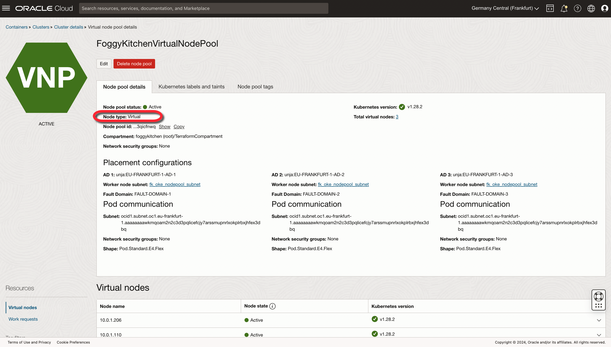

# FoggyKitchen OCI Container Engine for Kubernetes with Terraform 

## LESSON 4 - Creating OKE Enhanced Cluster with Virtual NodePool

In this lesson, we focus on setting up an OKE Enhanced Cluster with a Virtual NodePool. Virtual NodePools is a feature that enables on-demand scalability and efficient resource management without the need for physical node management. 



## Deploy Using Oracle Resource Manager

1. Click [](https://cloud.oracle.com/resourcemanager/stacks/create?region=home&zipUrl=https://github.com/mlinxfeld/terraform-oci-fk-oke/releases/latest/download/terraform-oci-fk-oke-lesson4.zip)

    If you aren't already signed in, when prompted, enter the tenancy and user credentials.

2. Review and accept the terms and conditions.

3. Select the region where you want to deploy the stack.

4. Follow the on-screen prompts and instructions to create the stack.

5. After creating the stack, click **Terraform Actions**, and select **Plan**.

6. Wait for the job to be completed, and review the plan.

    To make any changes, return to the Stack Details page, click **Edit Stack**, and make the required changes. Then, run the **Plan** action again.

7. If no further changes are necessary, return to the Stack Details page, click **Terraform Actions**, and select **Apply**. 

## Deploy Using the Terraform CLI in Cloud Shell

### Clone of the repo into OCI Cloud Shell

Now, you'll want a local copy of this repo. You can make that with the commands:
Clone the repo from github by executing the command as follows and then go to proper subdirectory:

```
martin_lin@codeeditor:~ (eu-frankfurt-1)$ git clone https://github.com/mlinxfeld/terraform-oci-fk-oke.git

martin_lin@codeeditor:~ (eu-frankfurt-1)$ cd terraform-oci-fk-oke

martin_lin@codeeditor:terraform-oci-fk-oke (eu-frankfurt-1)$ cd training/lesson4_oke_virtual_nodes/
```

### Prerequisites
Create environment file with terraform.tfvars file starting with example file:

```
martin_lin@codeeditor:lesson4_oke_virtual_nodes (eu-frankfurt-1)$ cp terraform.tfvars.example terraform.tfvars

martin_lin@codeeditor:lesson4_oke_virtual_nodes (eu-frankfurt-1)$ vi terraform.tfvars

tenancy_ocid       = "ocid1.tenancy.oc1..<your_tenancy_ocid>"
compartment_ocid   = "ocid1.compartment.oc1..<your_comparment_ocid>"
region             = "<oci_region>"
```

### Initialize Terraform

Run the following command to initialize Terraform environment:

```
martin_lin@codeeditor:lesson4_oke_virtual_nodes (eu-frankfurt-1)$ terraform init

Initializing the backend...
Initializing modules...
Downloading git::https://github.com/mlinxfeld/terraform-oci-fk-oke.git for fk-oke...
- fk-oke in .terraform/modules/fk-oke

Initializing provider plugins...
- Reusing previous version of oracle/oci from the dependency lock file
- Reusing previous version of hashicorp/tls from the dependency lock file
- Installing oracle/oci v5.29.0...
- Installed oracle/oci v5.29.0 (signed by a HashiCorp partner, key ID 1533A49284137CEB)
- Installing hashicorp/tls v4.0.5...
- Installed hashicorp/tls v4.0.5 (signed by HashiCorp)

Partner and community providers are signed by their developers.
If you'd like to know more about provider signing, you can read about it here:
https://www.terraform.io/docs/cli/plugins/signing.html

Terraform has been successfully initialized!

You may now begin working with Terraform. Try running "terraform plan" to see
any changes that are required for your infrastructure. All Terraform commands
should now work.

If you ever set or change modules or backend configuration for Terraform,
rerun this command to reinitialize your working directory. If you forget, other
commands will detect it and remind you to do so if necessary.
```

### Apply the changes 

Run the following command for applying changes with the proposed plan:

```
martin_lin@codeeditor:lesson4_oke_virtual_nodes (eu-frankfurt-1)$ terraform apply
module.fk-oke.data.oci_containerengine_node_pool_option.fk_oke_node_pool_option: Reading...
module.fk-oke.data.oci_containerengine_addon_options.fk_oke_addon_options: Reading...
module.fk-oke.data.oci_identity_availability_domains.ADs: Reading...
module.fk-oke.data.oci_containerengine_cluster_option.fk_oke_cluster_option: Reading...
module.fk-oke.data.oci_identity_availability_domains.AD: Reading...
module.fk-oke.data.oci_core_services.AllOCIServices[0]: Reading...
module.fk-oke.data.oci_core_services.AllOCIServices[0]: Read complete after 0s [id=CoreServicesDataSource-0]
module.fk-oke.data.oci_identity_availability_domains.ADs: Read complete after 0s [id=IdentityAvailabilityDomainsDataSource-3596290162]
module.fk-oke.data.oci_containerengine_cluster_option.fk_oke_cluster_option: Read complete after 0s [id=ContainerengineClusterOptionDataSource-1870923232]
module.fk-oke.data.oci_identity_availability_domains.AD: Read complete after 0s [id=IdentityAvailabilityDomainsDataSource-3596290162]
module.fk-oke.data.oci_containerengine_addon_options.fk_oke_addon_options: Read complete after 0s [id=ContainerengineAddonOptionsDataSource-1219351960]
module.fk-oke.data.oci_containerengine_node_pool_option.fk_oke_node_pool_option: Read complete after 1s [id=ContainerengineNodePoolOptionDataSource-1870923232]

Terraform used the selected providers to generate the following execution
plan. Resource actions are indicated with the following symbols:
  + create
 <= read (data resources)

Terraform will perform the following actions:

  # module.fk-oke.data.oci_containerengine_addons.fk_oke_cluster_addons will be read during apply
  # (config refers to values not yet known)
 <= data "oci_containerengine_addons" "fk_oke_cluster_addons" {
      + addons     = (known after apply)
      + cluster_id = (known after apply)
      + id         = (known after apply)
    }

  # module.fk-oke.data.oci_containerengine_cluster_kube_config.KubeConfig will be read during apply
  # (config refers to values not yet known)
 <= data "oci_containerengine_cluster_kube_config" "KubeConfig" {
      + cluster_id    = (known after apply)
      + content       = (known after apply)
      + id            = (known after apply)
      + token_version = "2.0.0"
    }

  # module.fk-oke.oci_containerengine_cluster.fk_oke_cluster will be created
  + resource "oci_containerengine_cluster" "fk_oke_cluster" {
      + available_kubernetes_upgrades = (known after apply)
      + compartment_id                = "ocid1.compartment.oc1..aaaaaaaaiyy4srmrb32v5rlniicwmpxsytywiucgbcp5ext6e4ahjfuloewa"
      + defined_tags                  = (known after apply)
      + endpoints                     = (known after apply)
      + freeform_tags                 = (known after apply)
      + id                            = (known after apply)
      + kms_key_id                    = (known after apply)
      + kubernetes_version            = "v1.28.2"
      + lifecycle_details             = (known after apply)
      + metadata                      = (known after apply)
      + name                          = "FoggyKitchenOKECluster"
      + state                         = (known after apply)
      + type                          = "BASIC_CLUSTER"
      + vcn_id                        = (known after apply)

      + endpoint_config {
          + is_public_ip_enabled = true
          + subnet_id            = (known after apply)
        }

      + options {
          + service_lb_subnet_ids = (known after apply)

          + add_ons {
              + is_kubernetes_dashboard_enabled = true
              + is_tiller_enabled               = true
            }

          + admission_controller_options {
              + is_pod_security_policy_enabled = false
            }

          + kubernetes_network_config {
              + pods_cidr     = "10.1.0.0/16"
              + services_cidr = "10.2.0.0/16"
            }
        }
    }

  # module.fk-oke.oci_containerengine_virtual_node_pool.fk_oke_virtual_node_pool[0] will be created
  + resource "oci_containerengine_virtual_node_pool" "fk_oke_virtual_node_pool" {
      + cluster_id         = (known after apply)
      + compartment_id     = "ocid1.compartment.oc1..aaaaaaaaiyy4srmrb32v5rlniicwmpxsytywiucgbcp5ext6e4ahjfuloewa"
      + defined_tags       = (known after apply)
      + display_name       = "FoggyKitchenVirtualNodePool"
      + freeform_tags      = (known after apply)
      + id                 = (known after apply)
      + kubernetes_version = (known after apply)
      + lifecycle_details  = (known after apply)
      + nsg_ids            = (known after apply)
      + size               = 3
      + state              = (known after apply)
      + system_tags        = (known after apply)
      + time_created       = (known after apply)
      + time_updated       = (known after apply)

      + pod_configuration {
          + nsg_ids   = (known after apply)
          + shape     = "Pod.Standard.E4.Flex"
          + subnet_id = (known after apply)
        }
    }
  
 (...)

  # module.fk-oke.tls_private_key.public_private_key_pair will be created
  + resource "tls_private_key" "public_private_key_pair" {
      + algorithm                     = "RSA"
      + ecdsa_curve                   = "P224"
      + id                            = (known after apply)
      + private_key_openssh           = (sensitive value)
      + private_key_pem               = (sensitive value)
      + private_key_pem_pkcs8         = (sensitive value)
      + public_key_fingerprint_md5    = (known after apply)
      + public_key_fingerprint_sha256 = (known after apply)
      + public_key_openssh            = (known after apply)
      + public_key_pem                = (known after apply)
      + rsa_bits                      = 2048
    }

Plan: 17 to add, 0 to change, 0 to destroy.

Changes to Outputs:
  + Cluster       = {
      + id                 = (known after apply)
      + kubernetes_version = "v1.28.2"
      + name               = "FoggyKitchenOKECluster"
    }
  + ClusterAddOns = {
      + addons     = (known after apply)
      + cluster_id = (known after apply)
      + filter     = []
      + id         = (known after apply)
    }
  + KubeConfig    = (known after apply)
  + NodePool      = {
      + id                 = [
          + (known after apply),
        ]
      + kubernetes_version = [
          + (known after apply),
        ]
      + name               = [
          + "FoggyKitchenVirtualNodePool",
        ]
      + nodes              = null
    }

Do you want to perform these actions?
  Terraform will perform the actions described above.
  Only 'yes' will be accepted to approve.

  Enter a value: yes

(...)

null_resource.deploy_nginx(local-exec): Executing: ["/bin/sh" "-c" "kubectl get pods"]
null_resource.deploy_nginx (local-exec): NAME                                READY   STATUS    RESTARTS   AGE
null_resource.deploy_nginx (local-exec): nginx-deployment-6d999996df-5jbp9   1/1     Running   0          2m1s
null_resource.deploy_nginx (local-exec): nginx-deployment-6d999996df-76l2s   1/1     Running   0          2m1s
null_resource.deploy_nginx (local-exec): nginx-deployment-6d999996df-774th   1/1     Running   0          2m1s
null_resource.deploy_nginx (local-exec): nginx-deployment-6d999996df-bgbc6   1/1     Running   0          2m1s
null_resource.deploy_nginx (local-exec): nginx-deployment-6d999996df-gvmrj   1/1     Running   0          2m1s
null_resource.deploy_nginx (local-exec): nginx-deployment-6d999996df-m8h9k   1/1     Running   0          2m1s
null_resource.deploy_nginx (local-exec): nginx-deployment-6d999996df-mdgdt   1/1     Running   0          2m1s
null_resource.deploy_nginx (local-exec): nginx-deployment-6d999996df-n6h7w   1/1     Running   0          2m1s
null_resource.deploy_nginx (local-exec): nginx-deployment-6d999996df-q5n9t   1/1     Running   0          2m1s
null_resource.deploy_nginx (local-exec): nginx-deployment-6d999996df-r8vsn   1/1     Running   0          2m1s
null_resource.deploy_nginx: Provisioning with 'local-exec'...
null_resource.deploy_nginx(local-exec): Executing: ["/bin/sh" "-c" "kubectl describe  pods | grep '  IP:'"]
null_resource.deploy_nginx (local-exec):   IP:           10.0.1.30
null_resource.deploy_nginx (local-exec):   IP:           10.0.1.15
null_resource.deploy_nginx (local-exec):   IP:           10.0.1.62
null_resource.deploy_nginx (local-exec):   IP:           10.0.1.12
null_resource.deploy_nginx (local-exec):   IP:           10.0.1.35
null_resource.deploy_nginx (local-exec):   IP:           10.0.1.220
null_resource.deploy_nginx (local-exec):   IP:           10.0.1.143
null_resource.deploy_nginx (local-exec):   IP:           10.0.1.254
null_resource.deploy_nginx (local-exec):   IP:           10.0.1.87
null_resource.deploy_nginx (local-exec):   IP:           10.0.1.240
null_resource.deploy_nginx: Creation complete after 2m6s [id=8414799337788290871]
Apply complete! Resources: 17 added, 0 changed, 0 destroyed.
Outputs:
Cluster = {
  "id" = "ocid1.cluster.oc1.eu-frankfurt-1.aaaaaaaabjf4ukyub4rgtg46gd4x5gcmktoeprbvnyhtcbwyjc23bcbl6ula"
  "kubernetes_version" = "v1.28.2"
  "name" = "FoggyKitchenOKECluster"
}
KubeConfig = <<EOT
---
apiVersion: v1
kind: ""
clusters:
- name: cluster-c23bcbl6ula
  cluster:
    server: https://138.2.151.133:6443
    certificate-authority-data: LS0tLS1CR(...)Q0FURS0tLS0tCg==
users:
- name: user-c23bcbl6ula
  user:
    exec:
      apiVersion: client.authentication.k8s.io/v1beta1
      command: oci
      args:
      - ce
      - cluster
      - generate-token
      - --cluster-id
      - ocid1.cluster.oc1.eu-frankfurt-1.aaaaaaaabjf4ukyub4rgtg46gd4x5gcmktoeprbvnyhtcbwyjc23bcbl6ula
      - --region
      - eu-frankfurt-1
      env: []
contexts:
- name: context-c23bcbl6ula
  context:
    cluster: cluster-c23bcbl6ula
    user: user-c23bcbl6ula
current-context: context-c23bcbl6ula
EOT
NodePool = {
  "id" = tolist([
    "ocid1.nodepool.oc1.eu-frankfurt-1.aaaaaaaambacwztojnmamifejxvdnv6abubkgbvewovctym24nsh4jrks4qq",
  ])
  "kubernetes_version" = tolist([
    "v1.28.2",
  ])
  "name" = tolist([
    "FoggyKitchenVirtualNodePool1",
  ])
  "nodes" = [
    tolist([
      "10.0.1.10",
      "10.0.1.158",
      "10.0.1.137",
    ]),
  ]
}

```

### Destroy the changes 

Run the following command for destroying all resources:

```
martin_lin@codeeditor:lesson4_oke_virtual_nodes (eu-frankfurt-1)$ terraform destroy

data.template_file.nginx_deployment: Reading...
data.template_file.nginx_deployment: Read complete after 0s [id=e8338d25ad6bc03b264552a9cc6b9020e244555c6f3c6edc2b30afa6347c1c44]
local_file.nginx_deployment: Refreshing state... [id=daacc54085c4f86be24e42313b713188fe250a4f]
module.fk-oke.tls_private_key.public_private_key_pair: Refreshing state... [id=57c135f9de74e3ed4c8784f22501612a4bc05c31]
module.fk-oke.data.oci_containerengine_cluster_option.fk_oke_cluster_option: Reading...
module.fk-oke.data.oci_containerengine_addon_options.fk_oke_addon_options: Reading...
module.fk-oke.data.oci_containerengine_node_pool_option.fk_oke_node_pool_option: Reading...
module.fk-oke.data.oci_core_services.AllOCIServices[0]: Reading...
module.fk-oke.data.oci_identity_availability_domains.AD: Reading...
(...)
null_resource.deploy_nginx: Refreshing state... [id=6451609765774392253]
module.fk-oke.data.oci_containerengine_cluster_kube_config.KubeConfig: Read complete after 0s [id=ContainerengineClusterKubeConfigDataSource-1653731019]

Terraform used the selected providers to generate the following execution plan. Resource actions are indicated with the following symbols:
  - destroy

Terraform will perform the following actions:

  # local_file.nginx_deployment will be destroyed
  - resource "local_file" "nginx_deployment" {
      - content              = <<-EOT
            apiVersion: apps/v1
            kind: Deployment

(...)

Plan: 0 to add, 0 to change, 17 to destroy.

(...)

Do you really want to destroy all resources?
  Terraform will destroy all your managed infrastructure, as shown above.
  There is no undo. Only 'yes' will be accepted to confirm.

  Enter a value: yes

null_resource.deploy_nginx: Destroying... [id=6451609765774392253]
null_resource.deploy_nginx: Destruction complete after 0s
local_file.nginx_deployment: Destroying... [id=daacc54085c4f86be24e42313b713188fe250a4f]
local_file.nginx_deployment: Destruction complete after 0s
module.fk-oke.oci_containerengine_node_pool.fk_oke_node_pool[0]: Destroying... [id=ocid1.nodepool.oc1.eu-frankfurt-1.aaaaaaaaafe3nm3ecdihhsbe77rnlhqxg4bubpwttxomwsihingiaaksrkrq]
(...)
module.fk-oke.oci_core_internet_gateway.fk_oke_igw[0]: Destruction complete after 1s
module.fk-oke.oci_core_nat_gateway.fk_oke_natgw[0]: Destruction complete after 1s
module.fk-oke.oci_core_service_gateway.fk_oke_sg[0]: Destruction complete after 4s
module.fk-oke.oci_core_vcn.fk_oke_vcn[0]: Destroying... [id=ocid1.vcn.oc1.eu-frankfurt-1.amaaaaaadngk4giahjbeqi2bhvvsngjsyyarrxxmxw5tkxerzhytn2osk5nq]
module.fk-oke.oci_core_vcn.fk_oke_vcn[0]: Destruction complete after 0s
oci_identity_policy.fk_oke_virtual_node_pool_policy: Destroying... [id=ocid1.policy.oc1..aaaaaaaab5oodvxi52zzfdlpy5yb56fxkami64hcqwcbqdvsx6aim63keiga]
oci_identity_policy.fk_oke_virtual_node_pool_policy: Destruction complete after 1s

Destroy complete! Resources: 17 destroyed.
```