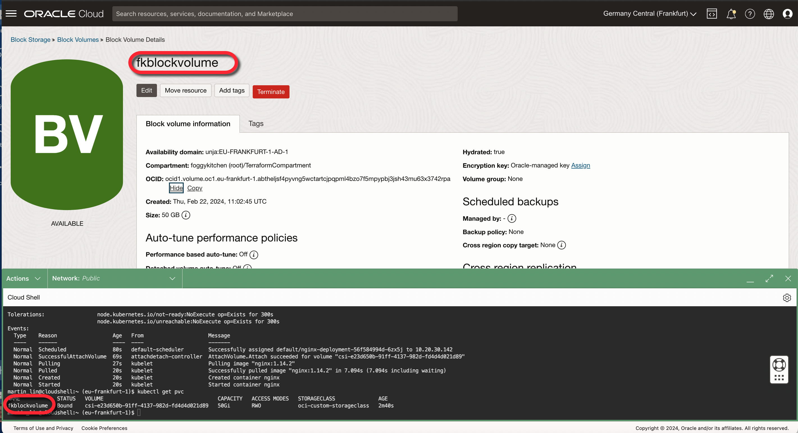

# FoggyKitchen OCI Container Engine for Kubernetes with Terraform 

## LESSON 7 - Creating OKE Cluster with OCI Block Volume as Kubernetes PVC

In this lesson, we guide you through the creation of an OKE (Oracle Kubernetes Engine) Cluster with OCI (Oracle Cloud Infrastructure) Block Volume as Kubernetes Persistent Volume Claims (PVCs), providing a comprehensive tutorial on enhancing your Kubernetes deployments with durable and scalable storage solutions. This lesson is specifically designed to teach you how to leverage OCI Block Volumes for persistent storage needs within your Kubernetes environment, ensuring data persistence across pod reassignments and restarts. We will cover the intricacies of integrating OCI Block Volumes as PVCs, including provisioning, attaching, and managing block storage volumes to meet the dynamic storage requirements of your applications.



## Deploy Using Oracle Resource Manager

1. Click [](https://cloud.oracle.com/resourcemanager/stacks/create?region=home&zipUrl=https://github.com/mlinxfeld/terraform-oci-fk-oke/releases/latest/download/terraform-oci-fk-oke-lesson7.zip)

    If you aren't already signed in, when prompted, enter the tenancy and user credentials.

2. Review and accept the terms and conditions.

3. Select the region where you want to deploy the stack.

4. Follow the on-screen prompts and instructions to create the stack.

5. After creating the stack, click **Terraform Actions**, and select **Plan**.

6. Wait for the job to be completed, and review the plan.

    To make any changes, return to the Stack Details page, click **Edit Stack**, and make the required changes. Then, run the **Plan** action again.

7. If no further changes are necessary, return to the Stack Details page, click **Terraform Actions**, and select **Apply**. 

## Deploy Using the Terraform CLI in Cloud Shell

### Clone of the repo into OCI Cloud Shell

Now, you'll want a local copy of this repo. You can make that with the commands:
Clone the repo from github by executing the command as follows and then go to proper subdirectory:

```
martin_lin@codeeditor:~ (eu-frankfurt-1)$ git clone https://github.com/mlinxfeld/terraform-oci-fk-oke.git

martin_lin@codeeditor:~ (eu-frankfurt-1)$ cd terraform-oci-fk-oke

martin_lin@codeeditor:terraform-oci-fk-oke (eu-frankfurt-1)$ cd training/lesson7_oke_block_volume_pvc/
```

### Prerequisites
Create environment file with terraform.tfvars file starting with example file:

```
martin_lin@codeeditor:lesson7_oke_block_volume_pvc (eu-frankfurt-1)$ cp terraform.tfvars.example terraform.tfvars

martin_lin@codeeditor:lesson7_oke_block_volume_pvc (eu-frankfurt-1)$ vi terraform.tfvars

tenancy_ocid       = "ocid1.tenancy.oc1..<your_tenancy_ocid>"
compartment_ocid   = "ocid1.compartment.oc1..<your_comparment_ocid>"
region             = "<oci_region>"
```

### Initialize Terraform

Run the following command to initialize Terraform environment:

```
martin_lin@codeeditor:lesson7_oke_block_volume_pvc (eu-frankfurt-1)$ terraform init

Initializing the backend...
Initializing modules...
Downloading git::https://github.com/mlinxfeld/terraform-oci-fk-oke.git for fk-oke...
- fk-oke in .terraform/modules/fk-oke

Initializing provider plugins...
- Reusing previous version of oracle/oci from the dependency lock file
- Reusing previous version of hashicorp/tls from the dependency lock file
- Installing oracle/oci v5.29.0...
- Installed oracle/oci v5.29.0 (signed by a HashiCorp partner, key ID 1533A49284137CEB)
- Installing hashicorp/tls v4.0.5...
- Installed hashicorp/tls v4.0.5 (signed by HashiCorp)

Partner and community providers are signed by their developers.
If you'd like to know more about provider signing, you can read about it here:
https://www.terraform.io/docs/cli/plugins/signing.html

Terraform has been successfully initialized!

You may now begin working with Terraform. Try running "terraform plan" to see
any changes that are required for your infrastructure. All Terraform commands
should now work.

If you ever set or change modules or backend configuration for Terraform,
rerun this command to reinitialize your working directory. If you forget, other
commands will detect it and remind you to do so if necessary.
```

### Apply the changes 

Run the following command for applying changes with the proposed plan:

```
martin_lin@codeeditor:lesson7_oke_block_volume_pvc (eu-frankfurt-1)$ terraform apply
data.template_file.storageclass_deployment: Reading...
data.template_file.storageclass_deployment: Read complete after 0s [id=369a254bdcb83202c8156b1d0d0c6bb5c348c45228667983720eecde248378e0]
module.fk-oke.data.oci_identity_availability_domains.AD: Reading...
module.fk-oke.data.oci_containerengine_cluster_option.fk_oke_cluster_option: Reading...
module.fk-oke.data.oci_identity_availability_domains.ADs: Reading...
module.fk-oke.data.oci_containerengine_addon_options.fk_oke_addon_options: Reading...
module.fk-oke.data.oci_containerengine_node_pool_option.fk_oke_node_pool_option: Reading...
module.fk-oke.data.oci_identity_availability_domains.AD: Read complete after 0s [id=IdentityAvailabilityDomainsDataSource-3596290162]
module.fk-oke.data.oci_identity_availability_domains.ADs: Read complete after 0s [id=IdentityAvailabilityDomainsDataSource-3596290162]
module.fk-oke.data.oci_containerengine_cluster_option.fk_oke_cluster_option: Read complete after 0s [id=ContainerengineClusterOptionDataSource-1870923232]
module.fk-oke.data.oci_containerengine_addon_options.fk_oke_addon_options: Read complete after 0s [id=ContainerengineAddonOptionsDataSource-1219351960]
data.oci_core_services.FoggyKitchenAllOCIServices: Reading...
data.oci_identity_availability_domains.ADs: Reading...
data.oci_identity_availability_domains.ADs: Read complete after 0s [id=IdentityAvailabilityDomainsDataSource-3596290162]
data.oci_core_services.FoggyKitchenAllOCIServices: Read complete after 0s [id=CoreServicesDataSource-0]
module.fk-oke.data.oci_containerengine_node_pool_option.fk_oke_node_pool_option: Read complete after 1s [id=ContainerengineNodePoolOptionDataSource-1870923232]

Terraform used the selected providers to generate the following execution plan. Resource actions are indicated with the following symbols:
  + create
 <= read (data resources)

Terraform will perform the following actions:

  # data.template_file.nginx_deployment will be read during apply
  # (depends on a resource or a module with changes pending)
 <= data "template_file" "nginx_deployment" {
      + id       = (known after apply)
      + rendered = (known after apply)
      + template = <<-EOT
            apiVersion: apps/v1
            kind: Deployment
            metadata:
              name: nginx-deployment
            spec:
              selector:
                matchLabels:
                  app: nginx
              replicas: 1
              template:
                metadata:
                  labels:
                    app: nginx
                spec:
                  containers:
                  - name: nginx
                    image: nginx:1.14.2
                    ports:
                    - containerPort: 80
                    resources:
                      requests:
                        memory: "500Mi"
                    volumeMounts:
                      - name: data
                        mountPath: /var/www/html
                  volumes:
                    - name: data
                      persistentVolumeClaim:
                        claimName: ${block_volume_name}
                  ${ is_arm_node_shape ? "nodeSelector:" : "" }
                    ${ is_arm_node_shape ? "kubernetes.io/arch: arm64" : "" }
        EOT
      + vars     = {
          + "block_volume_name" = "fkblockvolume"
          + "is_arm_node_shape" = "true"
        }
    }

(...)

# module.fk-oke.tls_private_key.public_private_key_pair will be created
  + resource "tls_private_key" "public_private_key_pair" {
      + algorithm                     = "RSA"
      + ecdsa_curve                   = "P224"
      + id                            = (known after apply)
      + private_key_openssh           = (sensitive value)
      + private_key_pem               = (sensitive value)
      + private_key_pem_pkcs8         = (sensitive value)
      + public_key_fingerprint_md5    = (known after apply)
      + public_key_fingerprint_sha256 = (known after apply)
      + public_key_openssh            = (known after apply)
      + public_key_pem                = (known after apply)
      + rsa_bits                      = 2048
    }

Plan: 28 to add, 0 to change, 0 to destroy.

Changes to Outputs:
  + Cluster    = {
      + id                 = (known after apply)
      + kubernetes_version = "v1.28.2"
      + name               = "FoggyKitchenOKECluster"
    }
  + KubeConfig = (known after apply)
  + NodePool   = {
      + id                 = [
          + (known after apply),
        ]
      + kubernetes_version = [
          + "v1.28.2",
        ]
      + name               = [
          + "FoggyKitchenNodePool1",
        ]
      + nodes              = [
          + (known after apply),
        ]
    }

Do you want to perform these actions?
  Terraform will perform the actions described above.
  Only 'yes' will be accepted to approve.

  Enter a value: yes

(...)

null_resource.deploy_oke_nginx: Still creating... [1m30s elapsed]
null_resource.deploy_oke_nginx: Still creating... [1m40s elapsed]
null_resource.deploy_oke_nginx: Still creating... [1m50s elapsed]
null_resource.deploy_oke_nginx: Still creating... [2m0s elapsed]
null_resource.deploy_oke_nginx: Provisioning with 'local-exec'...
null_resource.deploy_oke_nginx (local-exec): Executing: ["/bin/sh" "-c" "kubectl describe pod nginx"]
null_resource.deploy_oke_nginx (local-exec): Name:             nginx-deployment-56f584994d-6zx5j
null_resource.deploy_oke_nginx (local-exec): Namespace:        default
null_resource.deploy_oke_nginx (local-exec): Priority:         0
null_resource.deploy_oke_nginx (local-exec): Service Account:  default
null_resource.deploy_oke_nginx (local-exec): Node:             10.20.30.142/10.20.30.142
null_resource.deploy_oke_nginx (local-exec): Start Time:       Thu, 22 Feb 2024 11:18:25 +0000
null_resource.deploy_oke_nginx (local-exec): Labels:           app=nginx
null_resource.deploy_oke_nginx (local-exec):                   pod-template-hash=56f584994d
null_resource.deploy_oke_nginx (local-exec): Annotations:      <none>
null_resource.deploy_oke_nginx (local-exec): Status:           Running
null_resource.deploy_oke_nginx (local-exec): IP:               10.20.30.4
null_resource.deploy_oke_nginx (local-exec): IPs:
null_resource.deploy_oke_nginx (local-exec):   IP:           10.20.30.4
null_resource.deploy_oke_nginx (local-exec): Controlled By:  ReplicaSet/nginx-deployment-56f584994d
null_resource.deploy_oke_nginx (local-exec): Containers:
null_resource.deploy_oke_nginx (local-exec):   nginx:
null_resource.deploy_oke_nginx (local-exec):     Container ID:   cri-o://638a213d306fa73587a663fe0d6465551e38018bf41b551a01cc45b5ebc4c519
null_resource.deploy_oke_nginx (local-exec):     Image:          nginx:1.14.2
null_resource.deploy_oke_nginx (local-exec):     Image ID:       7bbc8783b8ecfdb6453396805cc0fb5fcdaf1b16cbb907c8ab1b8685732d50a4
null_resource.deploy_oke_nginx (local-exec):     Port:           80/TCP
null_resource.deploy_oke_nginx (local-exec):     Host Port:      0/TCP
null_resource.deploy_oke_nginx (local-exec):     State:          Running
null_resource.deploy_oke_nginx (local-exec):       Started:      Thu, 22 Feb 2024 11:19:25 +0000
null_resource.deploy_oke_nginx (local-exec):     Ready:          True
null_resource.deploy_oke_nginx (local-exec):     Restart Count:  0
null_resource.deploy_oke_nginx (local-exec):     Requests:
null_resource.deploy_oke_nginx (local-exec):       memory:     500Mi
null_resource.deploy_oke_nginx (local-exec):     Environment:  <none>
null_resource.deploy_oke_nginx (local-exec):     Mounts:
null_resource.deploy_oke_nginx (local-exec):       /var/run/secrets/kubernetes.io/serviceaccount from kube-api-access-bccs5 (ro)
null_resource.deploy_oke_nginx (local-exec):       /var/www/html from data (rw)
null_resource.deploy_oke_nginx (local-exec): Conditions:
null_resource.deploy_oke_nginx (local-exec):   Type              Status
null_resource.deploy_oke_nginx (local-exec):   Initialized       True
null_resource.deploy_oke_nginx (local-exec):   Ready             True
null_resource.deploy_oke_nginx (local-exec):   ContainersReady   True
null_resource.deploy_oke_nginx (local-exec):   PodScheduled      True
null_resource.deploy_oke_nginx (local-exec): Volumes:
null_resource.deploy_oke_nginx (local-exec):   data:
null_resource.deploy_oke_nginx (local-exec):     Type:       PersistentVolumeClaim (a reference to a PersistentVolumeClaim in the same namespace)
null_resource.deploy_oke_nginx (local-exec):     ClaimName:  fkblockvolume
null_resource.deploy_oke_nginx (local-exec):     ReadOnly:   false
null_resource.deploy_oke_nginx (local-exec):   kube-api-access-bccs5:
null_resource.deploy_oke_nginx (local-exec):     Type:                    Projected (a volume that contains injected data from multiple sources)
null_resource.deploy_oke_nginx (local-exec):     TokenExpirationSeconds:  3607
null_resource.deploy_oke_nginx (local-exec):     ConfigMapName:           kube-root-ca.crt
null_resource.deploy_oke_nginx (local-exec):     ConfigMapOptional:       <nil>
null_resource.deploy_oke_nginx (local-exec):     DownwardAPI:             true
null_resource.deploy_oke_nginx (local-exec): QoS Class:                   Burstable
null_resource.deploy_oke_nginx (local-exec): Node-Selectors:              kubernetes.io/arch=arm64
null_resource.deploy_oke_nginx (local-exec): Tolerations:                 node.kubernetes.io/not-ready:NoExecute op=Exists for 300s
null_resource.deploy_oke_nginx (local-exec):                              node.kubernetes.io/unreachable:NoExecute op=Exists for 300s
null_resource.deploy_oke_nginx (local-exec): Events:
null_resource.deploy_oke_nginx (local-exec):   Type    Reason                  Age   From                     Message
null_resource.deploy_oke_nginx (local-exec):   ----    ------                  ----  ----                     -------
null_resource.deploy_oke_nginx (local-exec):   Normal  Scheduled               110s  default-scheduler        Successfully assigned default/nginx-deployment-56f584994d-6zx5j to 10.20.30.142
null_resource.deploy_oke_nginx (local-exec):   Normal  SuccessfulAttachVolume  99s   attachdetach-controller  AttachVolume.Attach succeeded for volume "csi-e23d650b-91ff-4137-982d-fd4d4d021d89"
null_resource.deploy_oke_nginx (local-exec):   Normal  Pulling                 57s   kubelet                  Pulling image "nginx:1.14.2"
null_resource.deploy_oke_nginx (local-exec):   Normal  Pulled                  50s   kubelet                  Successfully pulled image "nginx:1.14.2" in 7.094s (7.094s including waiting)
null_resource.deploy_oke_nginx (local-exec):   Normal  Created                 50s   kubelet                  Created container nginx
null_resource.deploy_oke_nginx (local-exec):   Normal  Started                 50s   kubelet                  Started container nginx

null_resource.deploy_oke_nginx: Provisioning with 'local-exec'...
null_resource.deploy_oke_nginx (local-exec): Executing: ["/bin/sh" "-c" "kubectl get services"]
null_resource.deploy_oke_nginx (local-exec): NAME         TYPE           CLUSTER-IP      EXTERNAL-IP       PORT(S)             AGE
null_resource.deploy_oke_nginx (local-exec): kubernetes   ClusterIP      10.96.0.1       <none>            443/TCP,12250/TCP   11m
null_resource.deploy_oke_nginx (local-exec): lb-service   LoadBalancer   10.96.239.225   130.162.219.117   80:32324/TCP        2m2s
null_resource.deploy_oke_nginx: Creation complete after 2m5s [id=6057806154138335972]

Apply complete! Resources: 28 added, 0 changed, 0 destroyed.

Outputs:

Cluster = {
  "id" = "ocid1.cluster.oc1.eu-frankfurt-1.aaaaaaaavvdknn5schlm6opun5ezxrnzf53ca4itf4ylui6vxcnkynrdwz4q"
  "kubernetes_version" = "v1.28.2"
  "name" = "FoggyKitchenOKECluster"
}
KubeConfig = <<EOT
---
apiVersion: v1
kind: ""
clusters:
- name: cluster-cnkynrdwz4q
  cluster:
    server: https://158.180.49.170:6443
    certificate-authority-data: LS0tLS1CRUdJTiBD(...)0tCg==
users:
- name: user-cnkynrdwz4q
  user:
    exec:
      apiVersion: client.authentication.k8s.io/v1beta1
      command: oci
      args:
      - ce
      - cluster
      - generate-token
      - --cluster-id
      - ocid1.cluster.oc1.eu-frankfurt-1.aaaaaaaavvdknn5schlm6opun5ezxrnzf53ca4itf4ylui6vxcnkynrdwz4q
      - --region
      - eu-frankfurt-1
      env: []
contexts:
- name: context-cnkynrdwz4q
  context:
    cluster: cluster-cnkynrdwz4q
    user: user-cnkynrdwz4q
current-context: context-cnkynrdwz4q

EOT
NodePool = {
  "id" = tolist([
    "ocid1.nodepool.oc1.eu-frankfurt-1.aaaaaaaaeuwkmppnwkhkujlfegdnydtkrrzlfbye2rjin7l6bnxqdq2vzthq",
  ])
  "kubernetes_version" = tolist([
    "v1.28.2",
  ])
  "name" = tolist([
    "FoggyKitchenNodePool1",
  ])
  "nodes" = [
    tolist([
      "10.20.30.41",
      "10.20.30.211",
      "10.20.30.142",
    ]),
  ]
}

```

### Destroy the changes 

Run the following command for destroying all resources:

```
martin_lin@codeeditor:lesson7_oke_block_volume_pvc (eu-frankfurt-1)$ terraform destroy

data.template_file.nginx_deployment: Reading...
data.template_file.nginx_deployment: Read complete after 0s [id=e8338d25ad6bc03b264552a9cc6b9020e244555c6f3c6edc2b30afa6347c1c44]
local_file.nginx_deployment: Refreshing state... [id=daacc54085c4f86be24e42313b713188fe250a4f]
module.fk-oke.tls_private_key.public_private_key_pair: Refreshing state... [id=a0d8d08f600145b9e1a27e09c39510dd245f7319]

(...)

Plan: 0 to add, 0 to change, 28 to destroy.

(...)

Do you really want to destroy all resources?
  Terraform will destroy all your managed infrastructure, as shown above.
  There is no undo. Only 'yes' will be accepted to confirm.

  Enter a value: yes

null_resource.deploy_nginx: Destroying... [id=7319859307512728147]
null_resource.deploy_nginx: Provisioning with 'local-exec'...
null_resource.deploy_nginx (local-exec): Executing: ["/bin/sh" "-c" "kubectl delete service lb-service"]
null_resource.deploy_nginx (local-exec): service "lb-service" deleted
oci_core_network_security_group_security_rule.FoggyKitchenOKELBSecurityEgressGroupRule[0]: Destroying... [id=3DEBCD]
oci_core_network_security_group_security_rule.FoggyKitchenOKELBSecurityIngressGroupRules[0]: Destroying... [id=4D52EA]
oci_core_network_security_group_security_rule.FoggyKitchenNSGRule12250: Destroying... [id=A1600C]
oci_core_network_security_group_security_rule.FoggyKitchenNSGRule6443: Destroying... [id=EA3C09]
oci_core_network_security_group_security_rule.FoggyKitchenNSGRule12250: Destruction complete after 0s
oci_core_network_security_group_security_rule.FoggyKitchenOKELBSecurityEgressGroupRule[0]: Destruction complete after 0s
oci_core_network_security_group_security_rule.FoggyKitchenOKELBSecurityIngressGroupRules[0]: Destruction complete after 0s
oci_core_network_security_group_security_rule.FoggyKitchenNSGRule6443: Destruction complete after 0s
(...)

oci_core_subnet.FoggyKitchenOKEAPIEndpointSubnet: Destroying... [id=ocid1.subnet.oc1.eu-frankfurt-1.aaaaaaaajmlvwosnhm762oobaxentyllu2yp6qm4otnf52q6zt6wmsztmpaa]
oci_core_subnet.FoggyKitchenOKELBSubnet: Destroying... [id=ocid1.subnet.oc1.eu-frankfurt-1.aaaaaaaawjioqx5hkokqclfesf6fpgn64davvpv6nsr3hji2kesktojezzba]
oci_core_subnet.FoggyKitchenOKEAPIEndpointSubnet: Destruction complete after 1s
oci_core_security_list.FoggyKitchenOKEAPIEndpointSecurityList: Destroying... [id=ocid1.securitylist.oc1.eu-frankfurt-1.aaaaaaaaif3padpaq6npikpxe7z5j7cloqgrit3e4nyx4pk7oeko5wrthyja]
oci_core_security_list.FoggyKitchenOKEAPIEndpointSecurityList: Destruction complete after 1s
oci_core_subnet.FoggyKitchenOKELBSubnet: Destruction complete after 2s
oci_core_route_table.FoggyKitchenVCNPublicRouteTable: Destroying... [id=ocid1.routetable.oc1.eu-frankfurt-1.aaaaaaaawz7hej2gwt67oc6ma4kytm4cfxc7mcod7zbviptiiovvr7pm7zhq]
oci_core_route_table.FoggyKitchenVCNPublicRouteTable: Destruction complete after 0s
oci_core_internet_gateway.FoggyKitchenInternetGateway: Destroying... [id=ocid1.internetgateway.oc1.eu-frankfurt-1.aaaaaaaapf6wvkthj2zpgnwknqffeeuxxesqct35y2ay5izcpujz3zjwqeka]
oci_core_internet_gateway.FoggyKitchenInternetGateway: Destruction complete after 1s
oci_core_virtual_network.FoggyKitchenVCN: Destroying... [id=ocid1.vcn.oc1.eu-frankfurt-1.amaaaaaadngk4giafrmpfjgtkviqrsg47bic5wq6wmiobbh3rvs6admbyvpa]
oci_core_virtual_network.FoggyKitchenVCN: Destruction complete after 0s

Destroy complete! Resources: 28 destroyed.

```