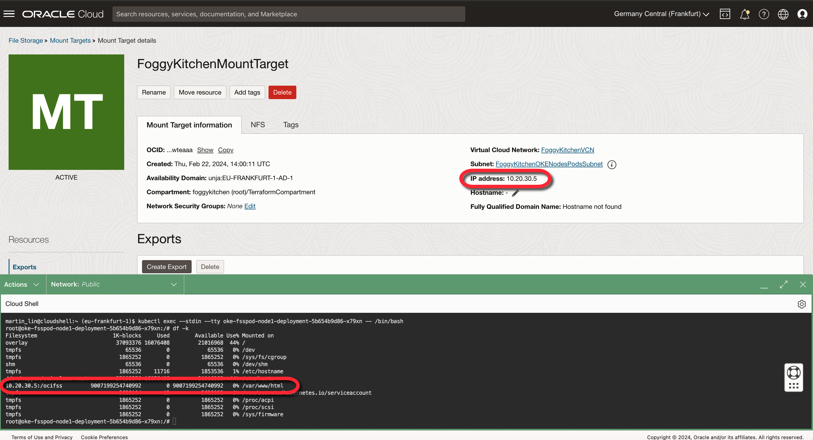

# FoggyKitchen OCI Container Engine for Kubernetes with Terraform 

## LESSON 8 - Creating OKE Cluster with OCI File Storage Service as Kubernetes PVC

In this lesson, we take a comprehensive look at creating an OKE (Oracle Kubernetes Engine) Cluster with OCI (Oracle Cloud Infrastructure) File Storage Service as Kubernetes Persistent Volume Claims (PVCs). This tutorial is aimed at equipping you with the knowledge to incorporate OCI File Storage Service into your Kubernetes deployments, offering a scalable, shared storage solution that supports the concurrent access needs of your applications. Throughout this lesson, we will dive into the process of setting up and integrating OCI File Storage Service as PVCs, demonstrating how to provision and mount shared file systems within your Kubernetes environment. The focus will be on the seamless management of file storage, enabling applications to efficiently share data across multiple pods and nodes.



## Deploy Using Oracle Resource Manager

1. Click [](https://cloud.oracle.com/resourcemanager/stacks/create?region=home&zipUrl=https://github.com/mlinxfeld/terraform-oci-fk-oke/releases/latest/download/terraform-oci-fk-oke-lesson8.zip)

    If you aren't already signed in, when prompted, enter the tenancy and user credentials.

2. Review and accept the terms and conditions.

3. Select the region where you want to deploy the stack.

4. Follow the on-screen prompts and instructions to create the stack.

5. After creating the stack, click **Terraform Actions**, and select **Plan**.

6. Wait for the job to be completed, and review the plan.

    To make any changes, return to the Stack Details page, click **Edit Stack**, and make the required changes. Then, run the **Plan** action again.

7. If no further changes are necessary, return to the Stack Details page, click **Terraform Actions**, and select **Apply**. 

## Deploy Using the Terraform CLI in Cloud Shell

### Clone of the repo into OCI Cloud Shell

Now, you'll want a local copy of this repo. You can make that with the commands:
Clone the repo from github by executing the command as follows and then go to proper subdirectory:

```
martin_lin@codeeditor:~ (eu-frankfurt-1)$ git clone https://github.com/mlinxfeld/terraform-oci-fk-oke.git

martin_lin@codeeditor:~ (eu-frankfurt-1)$ cd terraform-oci-fk-oke

martin_lin@codeeditor:terraform-oci-fk-oke (eu-frankfurt-1)$ cd training/lesson8_oke_fss_pvc/
```

### Prerequisites
Create environment file with terraform.tfvars file starting with example file:

```
martin_lin@codeeditor:lesson8_oke_fss_pvc (eu-frankfurt-1)$ cp terraform.tfvars.example terraform.tfvars

martin_lin@codeeditor:lesson8_oke_fss_pvc (eu-frankfurt-1)$ vi terraform.tfvars

tenancy_ocid       = "ocid1.tenancy.oc1..<your_tenancy_ocid>"
compartment_ocid   = "ocid1.compartment.oc1..<your_comparment_ocid>"
region             = "<oci_region>"
```

### Initialize Terraform

Run the following command to initialize Terraform environment:

```
martin_lin@codeeditor:lesson8_oke_fss_pvc (eu-frankfurt-1)$ terraform init

Initializing the backend...
Initializing modules...
Downloading git::https://github.com/mlinxfeld/terraform-oci-fk-oke.git for fk-oke...
- fk-oke in .terraform/modules/fk-oke

Initializing provider plugins...
- Reusing previous version of oracle/oci from the dependency lock file
- Reusing previous version of hashicorp/tls from the dependency lock file
- Installing oracle/oci v5.29.0...
- Installed oracle/oci v5.29.0 (signed by a HashiCorp partner, key ID 1533A49284137CEB)
- Installing hashicorp/tls v4.0.5...
- Installed hashicorp/tls v4.0.5 (signed by HashiCorp)

Partner and community providers are signed by their developers.
If you'd like to know more about provider signing, you can read about it here:
https://www.terraform.io/docs/cli/plugins/signing.html

Terraform has been successfully initialized!

You may now begin working with Terraform. Try running "terraform plan" to see
any changes that are required for your infrastructure. All Terraform commands
should now work.

If you ever set or change modules or backend configuration for Terraform,
rerun this command to reinitialize your working directory. If you forget, other
commands will detect it and remind you to do so if necessary.
```

### Apply the changes 

Run the following command for applying changes with the proposed plan:

```
martin_lin@codeeditor:lesson8_oke_fss_pvc (eu-frankfurt-1)$ terraform apply
data.template_file.storageclass_deployment: Reading...
data.template_file.storageclass_deployment: Read complete after 0s [id=369a254bdcb83202c8156b1d0d0c6bb5c348c45228667983720eecde248378e0]
module.fk-oke.data.oci_identity_availability_domains.AD: Reading...
module.fk-oke.data.oci_containerengine_cluster_option.fk_oke_cluster_option: Reading...
module.fk-oke.data.oci_identity_availability_domains.ADs: Reading...
module.fk-oke.data.oci_containerengine_addon_options.fk_oke_addon_options: Reading...
module.fk-oke.data.oci_containerengine_node_pool_option.fk_oke_node_pool_option: Reading...
module.fk-oke.data.oci_identity_availability_domains.AD: Read complete after 0s [id=IdentityAvailabilityDomainsDataSource-3596290162]
module.fk-oke.data.oci_identity_availability_domains.ADs: Read complete after 0s [id=IdentityAvailabilityDomainsDataSource-3596290162]
module.fk-oke.data.oci_containerengine_cluster_option.fk_oke_cluster_option: Read complete after 0s [id=ContainerengineClusterOptionDataSource-1870923232]

(...)
 # local_file.pvc_deployment will be created
  + resource "local_file" "pvc_deployment" {
      + content              = <<-EOT
            apiVersion: v1
            kind: PersistentVolumeClaim
            metadata:
              name: oke-fsspvc
            spec:
              accessModes:
                - ReadWriteMany
              storageClassName: ""
              resources:
                requests:
                  storage: 100Gi
              volumeName: oke-fsspv
        EOT
      + content_base64sha256 = (known after apply)
      + content_base64sha512 = (known after apply)
      + content_md5          = (known after apply)
      + content_sha1         = (known after apply)
      + content_sha256       = (known after apply)
      + content_sha512       = (known after apply)
      + directory_permission = "0777"
      + file_permission      = "0777"
      + filename             = "./pvc.yaml"
      + id                   = (known after apply)
    }
(...)

  # module.fk-oke.tls_private_key.public_private_key_pair will be created
  + resource "tls_private_key" "public_private_key_pair" {
      + algorithm                     = "RSA"
      + ecdsa_curve                   = "P224"
      + id                            = (known after apply)
      + private_key_openssh           = (sensitive value)
      + private_key_pem               = (sensitive value)
      + private_key_pem_pkcs8         = (sensitive value)
      + public_key_fingerprint_md5    = (known after apply)
      + public_key_fingerprint_sha256 = (known after apply)
      + public_key_openssh            = (known after apply)
      + public_key_pem                = (known after apply)
      + rsa_bits                      = 2048
    }

Plan: 40 to add, 0 to change, 0 to destroy.

Changes to Outputs:
  + Cluster    = {
      + id                 = (known after apply)
      + kubernetes_version = "v1.28.2"
      + name               = "FoggyKitchenOKECluster"
    }
  + KubeConfig = (known after apply)
  + NodePool   = {
      + id                 = [
          + (known after apply),
        ]
      + kubernetes_version = [
          + "v1.28.2",
        ]
      + name               = [
          + "FoggyKitchenNodePool1",
        ]
      + nodes              = [
          + (known after apply),
        ]
    }

Do you want to perform these actions?
  Terraform will perform the actions described above.
  Only 'yes' will be accepted to approve.
  
  Enter a value: yes

(...)

null_resource.deploy_oke_nginx[2]: Still creating... [1m50s elapsed]
null_resource.deploy_oke_nginx[1]: Still creating... [1m50s elapsed]
null_resource.deploy_oke_nginx[0]: Still creating... [2m0s elapsed]
null_resource.deploy_oke_nginx[2]: Still creating... [2m0s elapsed]
null_resource.deploy_oke_nginx[1]: Still creating... [2m0s elapsed]
null_resource.deploy_oke_nginx[2]: Creation complete after 2m2s [id=4954259028034645714]
null_resource.deploy_oke_nginx[0]: Creation complete after 2m2s [id=1157867264830843151]
null_resource.deploy_oke_nginx[1]: Creation complete after 2m2s [id=8335889207612487435]
null_resource.deploy_oke_service: Creating...
null_resource.deploy_oke_service: Provisioning with 'local-exec'...
null_resource.deploy_oke_service (local-exec): Executing: ["/bin/sh" "-c" "kubectl get pods"]
null_resource.deploy_oke_service (local-exec): NAME                                           READY   STATUS    RESTARTS   AGE
null_resource.deploy_oke_service (local-exec): oke-fsspod-node1-deployment-5b654b9d86-x79xn   0/1     Pending   0          2m1s
null_resource.deploy_oke_service (local-exec): oke-fsspod-node2-deployment-6f68595d5b-mz49t   0/1     Pending   0          2m1s
null_resource.deploy_oke_service (local-exec): oke-fsspod-node3-deployment-795685f4b-5rzr2    0/1     Pending   0          2m1s
null_resource.deploy_oke_service: Provisioning with 'local-exec'...
null_resource.deploy_oke_service (local-exec): Executing: ["/bin/sh" "-c" "kubectl apply -f ./service.yaml --request-timeout=60s"]
null_resource.deploy_oke_service (local-exec): service/lb-service created
null_resource.deploy_oke_service: Provisioning with 'local-exec'...
null_resource.deploy_oke_service (local-exec): Executing: ["/bin/sh" "-c" "sleep 30"]
null_resource.deploy_oke_service: Still creating... [10s elapsed]
null_resource.deploy_oke_service: Still creating... [20s elapsed]
null_resource.deploy_oke_service: Still creating... [30s elapsed]
null_resource.deploy_oke_service: Provisioning with 'local-exec'...
null_resource.deploy_oke_service (local-exec): Executing: ["/bin/sh" "-c" "kubectl get services"]
null_resource.deploy_oke_service (local-exec): NAME         TYPE           CLUSTER-IP      EXTERNAL-IP     PORT(S)             AGE
null_resource.deploy_oke_service (local-exec): kubernetes   ClusterIP      10.96.0.1       <none>          443/TCP,12250/TCP   11m
null_resource.deploy_oke_service (local-exec): lb-service   LoadBalancer   10.96.141.150   144.24.179.63   80:30372/TCP        31s
null_resource.deploy_oke_service: Creation complete after 33s [id=49094936509005176]

Apply complete! Resources: 40 added, 0 changed, 0 destroyed.

Outputs:

Cluster = {
  "id" = "ocid1.cluster.oc1.eu-frankfurt-1.aaaaaaaa324x2j4cnleaqwc7c22k7xztggz6lnl3jrnkwuxqocyhrko7chnq"
  "kubernetes_version" = "v1.28.2"
  "name" = "FoggyKitchenOKECluster"
}
KubeConfig = <<EOT
---
apiVersion: v1
kind: ""
clusters:
- name: cluster-cyhrko7chnq
  cluster:
    server: https://138.2.172.165:6443
    certificate-authority-data: LS0tLS1CRUdJTiBDRV(...)Cg==
users:
- name: user-cyhrko7chnq
  user:
    exec:
      apiVersion: client.authentication.k8s.io/v1beta1
      command: oci
      args:
      - ce
      - cluster
      - generate-token
      - --cluster-id
      - ocid1.cluster.oc1.eu-frankfurt-1.aaaaaaaa324x2j4cnleaqwc7c22k7xztggz6lnl3jrnkwuxqocyhrko7chnq
      - --region
      - eu-frankfurt-1
      env: []
contexts:
- name: context-cyhrko7chnq
  context:
    cluster: cluster-cyhrko7chnq
    user: user-cyhrko7chnq
current-context: context-cyhrko7chnq

EOT
NodePool = {
  "id" = tolist([
    "ocid1.nodepool.oc1.eu-frankfurt-1.aaaaaaaaw7yz7hkop522lh3t6eu7atijfz2rjprohm6pmnu4intauxbt3xna",
  ])
  "kubernetes_version" = tolist([
    "v1.28.2",
  ])
  "name" = tolist([
    "FoggyKitchenNodePool1",
  ])
  "nodes" = [
    tolist([
      "10.20.30.117",
      "10.20.30.26",
      "10.20.30.78",
    ]),
  ]
}

```

### Destroy the changes 

Run the following command for destroying all resources:

```
martin_lin@codeeditor:lesson8_oke_fss_pvc (eu-frankfurt-1)$ terraform destroy

data.template_file.nginx_deployment: Reading...
data.template_file.nginx_deployment: Read complete after 0s [id=e8338d25ad6bc03b264552a9cc6b9020e244555c6f3c6edc2b30afa6347c1c44]
local_file.nginx_deployment: Refreshing state... [id=daacc54085c4f86be24e42313b713188fe250a4f]
module.fk-oke.tls_private_key.public_private_key_pair: Refreshing state... [id=a0d8d08f600145b9e1a27e09c39510dd245f7319]

(...)

Plan: 0 to add, 0 to change, 40 to destroy.

(...)

Do you really want to destroy all resources?
  Terraform will destroy all your managed infrastructure, as shown above.
  There is no undo. Only 'yes' will be accepted to confirm.

  Enter a value: yes

null_resource.deploy_oke_service: Destroying... [id=49094936509005176]
null_resource.deploy_oke_service: Provisioning with 'local-exec'...
null_resource.deploy_oke_service (local-exec): Executing: ["/bin/sh" "-c" "kubectl delete service lb-service"]
null_resource.deploy_oke_service (local-exec): service "lb-service" deleted
oci_file_storage_export_set.FoggyKitchenExportset: Destroying... [id=ocid1.exportset.oc1.eu_frankfurt_1.aaaaaby27vhqigg5mzzgcllqojxwiotfouwwm4tbnzvwm5lsoqwtcllbmqwteaaa]
oci_core_network_security_group_security_rule.FoggyKitchenNSGRule6443: Destroying... [id=75F1D6]
oci_core_network_security_group_security_rule.FoggyKitchenNSGRule12250: Destroying... [id=4FF8F4]
oci_file_storage_export.FoggyKitchenExport: Destroying... [id=ocid1.export.oc1.eu_frankfurt_1.aaaaaa4np2vd3gtkmzzgcllqojxwiotfouwwm4tbnzvwm5lsoqwtcllbmqwteaaa]
oci_core_network_security_group_security_rule.FoggyKitchenOKELBSecurityIngressGroupRules[0]: Destroying... [id=E85E0C]
oci_file_storage_export_set.FoggyKitchenExportset: Destruction complete after 0s
oci_core_network_security_group_security_rule.FoggyKitchenOKELBSecurityEgressGroupRule[0]: Destroying... [id=160098]
oci_core_network_security_group_security_rule.FoggyKitchenOKELBSecurityEgressGroupRule[0]: Destruction complete after 1s
oci_core_network_security_group_security_rule.FoggyKitchenNSGRule12250: Destruction complete after 1s
oci_core_network_security_group_security_rule.FoggyKitchenNSGRule6443: Destruction complete after 1s
(...)

oci_core_security_list.FoggyKitchenOKEAPIEndpointSecurityList: Destroying... [id=ocid1.securitylist.oc1.eu-frankfurt-1.aaaaaaaal23b6uf2w5f3hqklpej5u7db5fv7k4wgse4e52hrg6y36x3l23sq]
oci_core_security_list.FoggyKitchenOKEAPIEndpointSecurityList: Destruction complete after 1s
oci_core_subnet.FoggyKitchenOKELBSubnet: Destruction complete after 2s
oci_core_route_table.FoggyKitchenVCNPublicRouteTable: Destroying... [id=ocid1.routetable.oc1.eu-frankfurt-1.aaaaaaaaff6g6n4nxu7oyw2pwl5srbwg2jzd4efe44nkbrdnrti6dn7tbhma]
oci_core_route_table.FoggyKitchenVCNPublicRouteTable: Destruction complete after 1s
oci_core_internet_gateway.FoggyKitchenInternetGateway: Destroying... [id=ocid1.internetgateway.oc1.eu-frankfurt-1.aaaaaaaa3povajpvyqsja6dtwriut4ymktan7qyrnpuaso5t3lddjydecwya]
oci_core_internet_gateway.FoggyKitchenInternetGateway: Destruction complete after 0s
oci_core_virtual_network.FoggyKitchenVCN: Destroying... [id=ocid1.vcn.oc1.eu-frankfurt-1.amaaaaaadngk4giamz5uzksmtjxzmzzbhwcz44qvjjywlmvzj23h5ncudv7q]
oci_core_virtual_network.FoggyKitchenVCN: Destruction complete after 1s

Destroy complete! Resources: 40 destroyed.

```


## Contributing
This project is open source. Please submit your contributions by forking this repository and submitting a pull request! [FoggyKitchen.com](https://foggykitchen.com/) appreciates any contributions that are made by the open source community.

## License
Copyright (c) 2025 [FoggyKitchen.com](https://foggykitchen.com/)

Licensed under the Universal Permissive License (UPL), Version 1.0.

See [LICENSE](LICENSE) for more details.