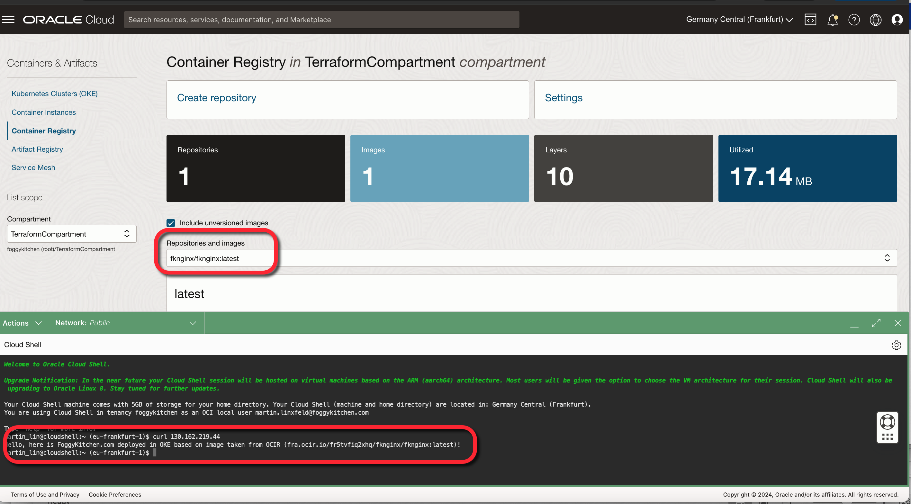

# FoggyKitchen OCI Container Engine for Kubernetes with Terraform 

## LESSON 8 - Creating OKE Cluster with image taken from OCI Registry (OCIR)

In this lesson, we focus on the creation of an OKE (Oracle Kubernetes Engine) Cluster utilizing images stored in the OCI Registry (OCIR). This tutorial aims to provide a detailed walkthrough for leveraging the Oracle Cloud Infrastructure Registry, a managed Docker registry service, for storing and managing your Docker images. Throughout this lesson, we will guide you through the process of configuring your OKE cluster to pull application images directly from OCIR, highlighting the seamless integration between OCI services and Kubernetes deployments.



## Deploy Using Oracle Resource Manager

1. Click [](https://cloud.oracle.com/resourcemanager/stacks/create?region=home&zipUrl=https://github.com/mlinxfeld/terraform-oci-fk-oke/releases/latest/download/terraform-oci-fk-oke-lesson9.zip)

    If you aren't already signed in, when prompted, enter the tenancy and user credentials.

2. Review and accept the terms and conditions.

3. Select the region where you want to deploy the stack.

4. Follow the on-screen prompts and instructions to create the stack.

5. After creating the stack, click **Terraform Actions**, and select **Plan**.

6. Wait for the job to be completed, and review the plan.

    To make any changes, return to the Stack Details page, click **Edit Stack**, and make the required changes. Then, run the **Plan** action again.

7. If no further changes are necessary, return to the Stack Details page, click **Terraform Actions**, and select **Apply**. 

## Deploy Using the Terraform CLI in Cloud Shell

### Clone of the repo into OCI Cloud Shell

Now, you'll want a local copy of this repo. You can make that with the commands:
Clone the repo from github by executing the command as follows and then go to proper subdirectory:

```
martin_lin@codeeditor:~ (eu-frankfurt-1)$ git clone https://github.com/mlinxfeld/terraform-oci-fk-oke.git

martin_lin@codeeditor:~ (eu-frankfurt-1)$ cd terraform-oci-fk-oke

martin_lin@codeeditor:terraform-oci-fk-oke (eu-frankfurt-1)$ cd training/lesson9_oke_ocir/
```

### Prerequisites
Create environment file with terraform.tfvars file starting with example file:

```
martin_lin@codeeditor:lesson9_oke_ocir (eu-frankfurt-1)$ cp terraform.tfvars.example terraform.tfvars

martin_lin@codeeditor:lesson9_oke_ocir (eu-frankfurt-1)$ vi terraform.tfvars

tenancy_ocid       = "ocid1.tenancy.oc1..<your_tenancy_ocid>"
compartment_ocid   = "ocid1.compartment.oc1..<your_comparment_ocid>"
region             = "<oci_region>"
ocir_user_name     = "<oci_username>" # in case of Oracle Identity Service accounts please add prefix "oracleidentitycloudservice/"
ocir_user_password = "<oci_auth_token>" 
```

### Initialize Terraform

Run the following command to initialize Terraform environment:

```
martin_lin@codeeditor:lesson9_oke_ocir (eu-frankfurt-1)$ terraform init

Initializing the backend...
Initializing modules...
Downloading git::https://github.com/mlinxfeld/terraform-oci-fk-oke.git for fk-oke...
- fk-oke in .terraform/modules/fk-oke

Initializing provider plugins...
- Reusing previous version of oracle/oci from the dependency lock file
- Reusing previous version of hashicorp/tls from the dependency lock file
- Installing oracle/oci v5.29.0...
- Installed oracle/oci v5.29.0 (signed by a HashiCorp partner, key ID 1533A49284137CEB)
- Installing hashicorp/tls v4.0.5...
- Installed hashicorp/tls v4.0.5 (signed by HashiCorp)

Partner and community providers are signed by their developers.
If you'd like to know more about provider signing, you can read about it here:
https://www.terraform.io/docs/cli/plugins/signing.html

Terraform has been successfully initialized!

You may now begin working with Terraform. Try running "terraform plan" to see
any changes that are required for your infrastructure. All Terraform commands
should now work.

If you ever set or change modules or backend configuration for Terraform,
rerun this command to reinitialize your working directory. If you forget, other
commands will detect it and remind you to do so if necessary.
```

### Apply the changes 

Run the following command for applying changes with the proposed plan:

```
martin_lin@codeeditor:lesson9_oke_ocir (eu-frankfurt-1)$ terraform apply
data.template_file.dockerfile_deployment: Reading...
data.template_file.dockerfile_deployment: Read complete after 0s [id=1ddd44a17bfa13a4266957d0c3cc29de533e019cf0068a905da57a2737020ff4]
module.fk-oke.data.oci_containerengine_addon_options.fk_oke_addon_options: Reading...
module.fk-oke.data.oci_identity_availability_domains.AD: Reading...
module.fk-oke.data.oci_containerengine_node_pool_option.fk_oke_node_pool_option: Reading...
data.oci_identity_regions.oci_regions: Reading...
module.fk-oke.data.oci_containerengine_cluster_option.fk_oke_cluster_option: Reading...
module.fk-oke.data.oci_identity_availability_domains.ADs: Reading...
data.oci_objectstorage_namespace.test_namespace: Reading...

(...)
 # oci_artifacts_container_repository.FoggyKitchenContainerRepository will be created
  + resource "oci_artifacts_container_repository" "FoggyKitchenContainerRepository" {
      + billable_size_in_gbs = (known after apply)
      + compartment_id       = "ocid1.compartment.oc1..aaaaaaaaiyy4srmrb32v5rlniicwmpxsytywiucgbcp5ext6e4ahjfuloewa"
      + created_by           = (known after apply)
      + defined_tags         = (known after apply)
      + display_name         = "fknginx/fknginx"
      + freeform_tags        = (known after apply)
      + id                   = (known after apply)
      + image_count          = (known after apply)
      + is_immutable         = (known after apply)
      + is_public            = false
      + layer_count          = (known after apply)
      + layers_size_in_bytes = (known after apply)
      + namespace            = (known after apply)
      + state                = (known after apply)
      + system_tags          = (known after apply)
      + time_created         = (known after apply)
      + time_last_pushed     = (known after apply)
    }

(...)

Plan: 28 to add, 0 to change, 0 to destroy.

Changes to Outputs:
  + Cluster    = {
      + id                 = (known after apply)
      + kubernetes_version = "v1.28.2"
      + name               = "FoggyKitchenOKECluster"
    }
  + KubeConfig = (known after apply)
  + NodePool   = {
      + id                 = [
          + (known after apply),
        ]
      + kubernetes_version = [
          + "v1.28.2",
        ]
      + name               = [
          + "FoggyKitchenNodePool1",
        ]
      + nodes              = [
          + (known after apply),
        ]
    }

Do you want to perform these actions?
  Terraform will perform the actions described above.
  Only 'yes' will be accepted to approve.

  Enter a value: yes

(...)

null_resource.deploy_oke_nginx (local-exec): Executing: ["/bin/sh" "-c" "kubectl get pods"]
null_resource.deploy_oke_nginx (local-exec): NAME                               READY   STATUS              RESTARTS   AGE
null_resource.deploy_oke_nginx (local-exec): nginx-deployment-bdf58864d-7p9w6   1/1     Running             0          63s
null_resource.deploy_oke_nginx (local-exec): nginx-deployment-bdf58864d-7q9r7   0/1     ContainerCreating   0          63s
null_resource.deploy_oke_nginx (local-exec): nginx-deployment-bdf58864d-9fvvk   1/1     Running             0          63s
null_resource.deploy_oke_nginx (local-exec): nginx-deployment-bdf58864d-ddkzz   0/1     Pending             0          63s
null_resource.deploy_oke_nginx (local-exec): nginx-deployment-bdf58864d-h54mx   0/1     ContainerCreating   0          63s
null_resource.deploy_oke_nginx (local-exec): nginx-deployment-bdf58864d-hnwq9   1/1     Running             0          64s
null_resource.deploy_oke_nginx (local-exec): nginx-deployment-bdf58864d-kkqjd   0/1     Pending             0          63s
null_resource.deploy_oke_nginx (local-exec): nginx-deployment-bdf58864d-phgsc   1/1     Running             0          63s
null_resource.deploy_oke_nginx (local-exec): nginx-deployment-bdf58864d-vqf5j   1/1     Running             0          63s
null_resource.deploy_oke_nginx (local-exec): nginx-deployment-bdf58864d-x9k5j   0/1     ContainerCreating   0          63s
null_resource.deploy_oke_nginx: Provisioning with 'local-exec'...
null_resource.deploy_oke_nginx (local-exec): Executing: ["/bin/sh" "-c" "kubectl get services"]
null_resource.deploy_oke_nginx: Still creating... [1m10s elapsed]
null_resource.deploy_oke_nginx (local-exec): NAME         TYPE           CLUSTER-IP     EXTERNAL-IP      PORT(S)             AGE
null_resource.deploy_oke_nginx (local-exec): kubernetes   ClusterIP      10.96.0.1      <none>           443/TCP,12250/TCP   5m12s
null_resource.deploy_oke_nginx (local-exec): lb-service   LoadBalancer   10.96.125.33   130.162.219.44   80:32160/TCP        63s
null_resource.deploy_oke_nginx: Provisioning with 'local-exec'...
null_resource.deploy_oke_nginx (local-exec): Executing: ["/bin/sh" "-c" "lb_ip_addpress=$(kubectl get service lb-service | awk  -F ' ' '{print $4}' | sed -n 2p) ; echo 'curl lb_ip_addpress:' ; curl $lb_ip_addpress"]
null_resource.deploy_oke_nginx (local-exec): curl lb_ip_addpress:
null_resource.deploy_oke_nginx (local-exec):   % Total    % Received % Xferd  Average Speed   Time    Time     Time  Current
null_resource.deploy_oke_nginx (local-exec):                                  Dload  Upload   Total   Spent    Left  Speed
null_resource.deploy_oke_nginx (local-exec):   0     0    0     0    0     0      0      0 --:--:-- --:--:-- --:--:--     0
null_resource.deploy_oke_nginx (local-exec): 100   130  100   130    0     0   8929      0 --:--:-- --:--:-- --:--:--  9285
null_resource.deploy_oke_nginx (local-exec): Hello, here is FoggyKitchen.com deployed in OKE based on image taken from OCIR (fra.ocir.io/fr5tvfiq2xhq/fknginx/fknginx:latest)!
null_resource.deploy_oke_nginx: Creation complete after 1m12s [id=4551079196406325737]

Apply complete! Resources: 28 added, 0 changed, 0 destroyed.

Outputs:

Cluster = {
  "id" = "ocid1.cluster.oc1.eu-frankfurt-1.aaaaaaaagvymdlur2a7nwqc5xudbzb5s3vv4jl5plux7wetrdcn4is4pyc7q"
  "kubernetes_version" = "v1.28.2"
  "name" = "FoggyKitchenOKECluster"
}
KubeConfig = <<EOT
---
apiVersion: v1
kind: ""
clusters:
- name: cluster-cn4is4pyc7q
  cluster:
    server: https://132.226.198.86:6443
    certificate-authority-data: LS0t(...)0tCg==
users:
- name: user-cn4is4pyc7q
  user:
    exec:
      apiVersion: client.authentication.k8s.io/v1beta1
      command: oci
      args:
      - ce
      - cluster
      - generate-token
      - --cluster-id
      - ocid1.cluster.oc1.eu-frankfurt-1.aaaaaaaagvymdlur2a7nwqc5xudbzb5s3vv4jl5plux7wetrdcn4is4pyc7q
      - --region
      - eu-frankfurt-1
      env: []
contexts:
- name: context-cn4is4pyc7q
  context:
    cluster: cluster-cn4is4pyc7q
    user: user-cn4is4pyc7q
current-context: context-cn4is4pyc7q

EOT
NodePool = {
  "id" = tolist([
    "ocid1.nodepool.oc1.eu-frankfurt-1.aaaaaaaayhxjhmepekrnzwigcqnqmbnjymptcuxqq4c5gn6hqnvaijafgnta",
  ])
  "kubernetes_version" = tolist([
    "v1.28.2",
  ])
  "name" = tolist([
    "FoggyKitchenNodePool1",
  ])
  "nodes" = [
    tolist([
      "10.20.30.15",
      "10.20.30.150",
      "10.20.30.171",
    ]),
  ]
}

```

### Destroy the changes 

Run the following command for destroying all resources:

```
martin_lin@codeeditor:lesson9_oke_ocir (eu-frankfurt-1)$ terraform destroy

data.template_file.nginx_deployment: Reading...
data.template_file.nginx_deployment: Read complete after 0s [id=e8338d25ad6bc03b264552a9cc6b9020e244555c6f3c6edc2b30afa6347c1c44]
local_file.nginx_deployment: Refreshing state... [id=daacc54085c4f86be24e42313b713188fe250a4f]
module.fk-oke.tls_private_key.public_private_key_pair: Refreshing state... [id=a0d8d08f600145b9e1a27e09c39510dd245f7319]

(...)

Plan: 0 to add, 0 to change, 28 to destroy.

(...)

Do you really want to destroy all resources?
  Terraform will destroy all your managed infrastructure, as shown above.
  There is no undo. Only 'yes' will be accepted to confirm.

  Enter a value: yes

null_resource.deploy_oke_nginx: Destroying... [id=4551079196406325737]
null_resource.deploy_oke_nginx: Provisioning with 'local-exec'...
null_resource.deploy_oke_nginx (local-exec): Executing: ["/bin/sh" "-c" "kubectl delete service lb-service"]
null_resource.deploy_oke_nginx (local-exec): service "lb-service" deleted
oci_core_network_security_group_security_rule.FoggyKitchenNSGRule12250: Destroying... [id=3E430C]
oci_core_network_security_group_security_rule.FoggyKitchenNSGRule6443: Destroying... [id=9ACC87]
oci_core_network_security_group_security_rule.FoggyKitchenOKELBSecurityEgressGroupRule[0]: Destroying... [id=32CF53]
oci_core_network_security_group_security_rule.FoggyKitchenOKELBSecurityIngressGroupRules[0]: Destroying... [id=286551]
oci_core_network_security_group_security_rule.FoggyKitchenNSGRule12250: Destruction complete after 0s
oci_core_network_security_group_security_rule.FoggyKitchenOKELBSecurityEgressGroupRule[0]: Destruction complete after 0s
(...)
module.fk-oke.oci_containerengine_cluster.fk_oke_cluster: Still destroying... [id=ocid1.cluster.oc1.eu-frankfurt-1.aaaaaa...c5xudbzb5s3vv4jl5plux7wetrdcn4is4pyc7q, 3m50s elapsed]
module.fk-oke.oci_containerengine_cluster.fk_oke_cluster: Still destroying... [id=ocid1.cluster.oc1.eu-frankfurt-1.aaaaaa...c5xudbzb5s3vv4jl5plux7wetrdcn4is4pyc7q, 4m0s elapsed]
module.fk-oke.oci_containerengine_cluster.fk_oke_cluster: Still destroying... [id=ocid1.cluster.oc1.eu-frankfurt-1.aaaaaa...c5xudbzb5s3vv4jl5plux7wetrdcn4is4pyc7q, 4m10s elapsed]
module.fk-oke.oci_containerengine_cluster.fk_oke_cluster: Still destroying... [id=ocid1.cluster.oc1.eu-frankfurt-1.aaaaaa...c5xudbzb5s3vv4jl5plux7wetrdcn4is4pyc7q, 4m20s elapsed]
module.fk-oke.oci_containerengine_cluster.fk_oke_cluster: Still destroying... [id=ocid1.cluster.oc1.eu-frankfurt-1.aaaaaa...c5xudbzb5s3vv4jl5plux7wetrdcn4is4pyc7q, 4m30s elapsed]
module.fk-oke.oci_containerengine_cluster.fk_oke_cluster: Still destroying... [id=ocid1.cluster.oc1.eu-frankfurt-1.aaaaaa...c5xudbzb5s3vv4jl5plux7wetrdcn4is4pyc7q, 4m40s elapsed]
module.fk-oke.oci_containerengine_cluster.fk_oke_cluster: Destruction complete after 4m49s
oci_core_subnet.FoggyKitchenOKEAPIEndpointSubnet: Destroying... [id=ocid1.subnet.oc1.eu-frankfurt-1.aaaaaaaapgox66ftwfosxyzkfmob6s4kw3tq7wzwbssx6ln2uolw2wcxblxa]
oci_core_subnet.FoggyKitchenOKELBSubnet: Destroying... [id=ocid1.subnet.oc1.eu-frankfurt-1.aaaaaaaae5gk6g6pdzvj4l4fobt3e5nutc4myeyqqb6muiu3twi7z6xgo3uq]
oci_core_subnet.FoggyKitchenOKEAPIEndpointSubnet: Destruction complete after 0s
oci_core_security_list.FoggyKitchenOKEAPIEndpointSecurityList: Destroying... [id=ocid1.securitylist.oc1.eu-frankfurt-1.aaaaaaaaotkqfdsqdjtlrqnkjiwujlfywpd76rthipcylslsokgptvrotpmq]
oci_core_security_list.FoggyKitchenOKEAPIEndpointSecurityList: Destruction complete after 1s
oci_core_subnet.FoggyKitchenOKELBSubnet: Destruction complete after 1s
oci_core_route_table.FoggyKitchenVCNPublicRouteTable: Destroying... [id=ocid1.routetable.oc1.eu-frankfurt-1.aaaaaaaabnnrbkxvtqimyduw4on22y32mjlq5kucusavjq2yltyqise6aepq]
oci_core_route_table.FoggyKitchenVCNPublicRouteTable: Destruction complete after 1s
oci_core_internet_gateway.FoggyKitchenInternetGateway: Destroying... [id=ocid1.internetgateway.oc1.eu-frankfurt-1.aaaaaaaa4nxogoud2n7sou4y2mzih52xgabvvtxkyjhbmnnwlx4hcu3nc2zq]
oci_core_internet_gateway.FoggyKitchenInternetGateway: Destruction complete after 0s
oci_core_virtual_network.FoggyKitchenVCN: Destroying... [id=ocid1.vcn.oc1.eu-frankfurt-1.amaaaaaadngk4giayik24ojqf4z4unomylfm4znxnlxry4fc6qqeqm46n5ca]
oci_core_virtual_network.FoggyKitchenVCN: Destruction complete after 1s

Destroy complete! Resources: 28 destroyed.

```